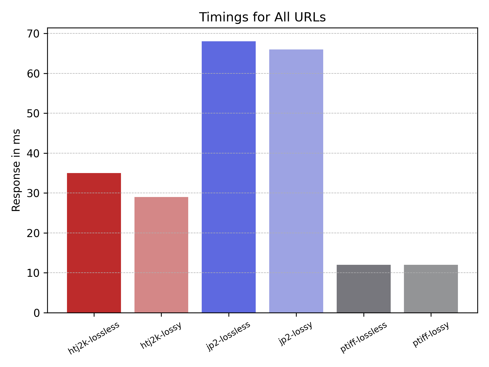
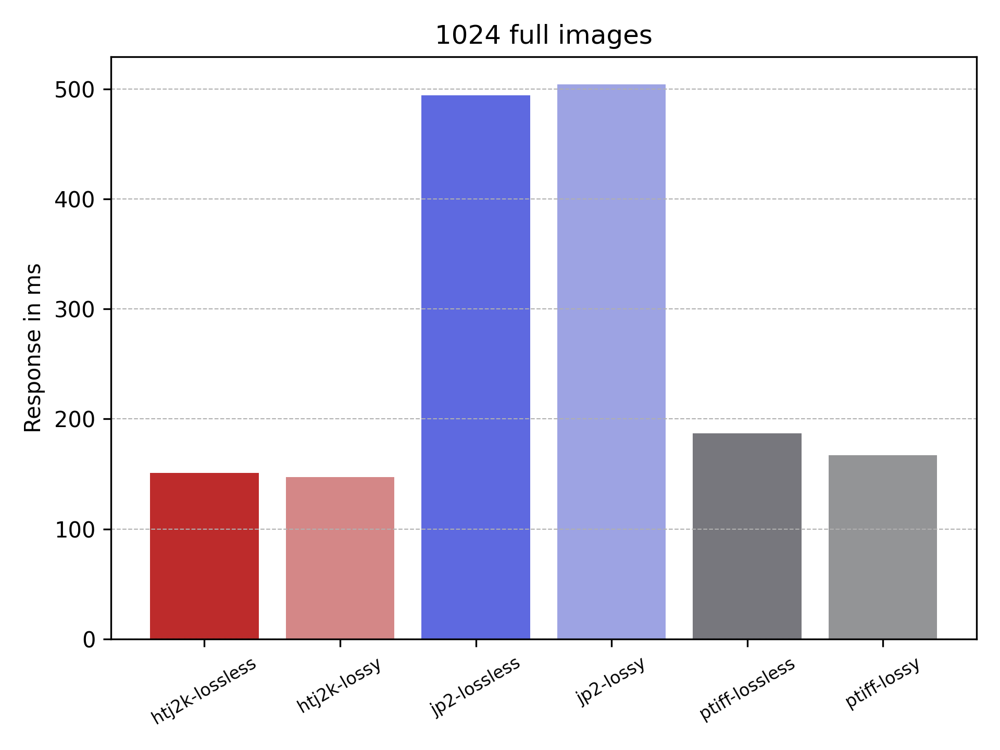
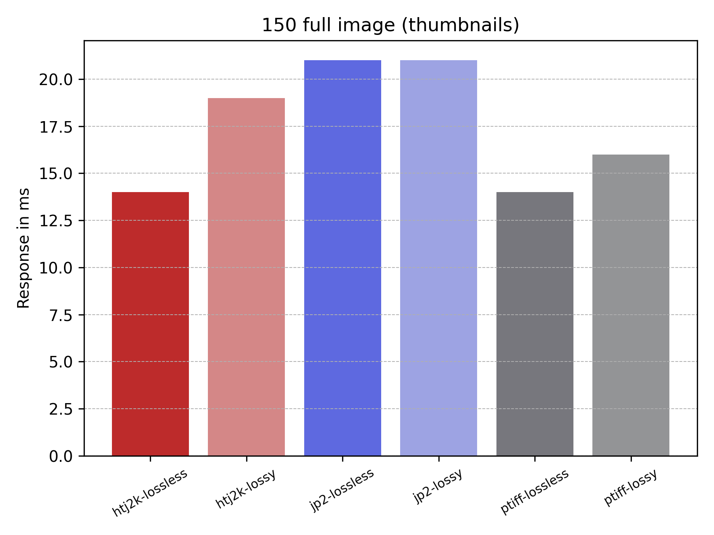

# Test run 18th August 2022

I will be using this document to detail the tests and scripts I ran to check htj2k decoding speeds against jp2 and ptiff. 


## Step 1: Source images

I am going to be using the same images and image URLs that Ruven has supplied and they can be found in:

[iiif_urls.txt](../../data/50_images/iiif_urls.txt)

To get the image names I ran:

```
cat data/50_images/iiif_urls.txt |awk -F\/ '{ print $1}' |sort |uniq  > data/image_list_50.txt
```

which created the [image_list_50.txt](../../data/50_images/image_list_50.txt) file which is a unique list of 50 filenames from the Getty collection of images. To download them I used the [imagelist.py](../../download/README.md) script as follows:

```
python imagelist.py ../data/50_images/image_list.txt ../imgs/50/original/
```

## Step 2: Generate the jp2, htj2k and ptiff derivatives 

I am going to use the convert.sh script but not I found an issue that the Mac date doesn't create Nano seconds so can't be used to do the timings. I've added a check to the convert script which will make sure you are using the GNU date. If not it won't make the log files.


PTiffs:

```
./convert/convert.sh imgs/50/original/ imgs/50/ptiff/lossy/ ptiff_lossy reports/glen/convert_logs 1
./convert/convert.sh imgs/50/original/ imgs/50/ptiff/lossless ptiff_lossless reports/glen/convert_logs 1
```

Compiling kakadu:

```
unzip v8_2_1-02075E.zip 
cd v8_2_1-02075E
```

Followed these instructions: https://github.com/IIIF/htj2k/tree/main/image_server 

```
cd make
make -f Makefile-Mac-x86-64-gcc clean
make -f Makefile-Mac-x86-64-gcc all_but_jni
```

and I've created a script which will add kdu to the path and also link in the libraries:

[setupKakadu.sh](setupKakadu.sh)

this can be run as follows:

```
source ./setupKakadu.sh
```

Although this didn't fix it as DYLD_LIBRARY_PATH is stripped by OS X... So I copied all of the libraries to /usr/local/lib:

```
cp ~/development/htj2k/image_server/kakadu/v8_2_1-02075E/lib/Mac-x86-64-gcc/* /usr/local/lib
```

Now I can generate the jp2s:

```
./convert.sh ../imgs/50/original/ ../imgs/50/jp2/lossy/ j2k1_lossy  reports/glen/convert_logs 1
./convert.sh ../imgs/50/original/ ../imgs/50/jp2/lossless/ j2k1_lossless reports/glen/convert_logs 1
./convert.sh ../imgs/50/original ../imgs/50/htj2k/lossless htj2k_lossless reports/glen/convert_logs 1
./convert.sh ../imgs/50/original ../imgs/50/htj2k/lossless htj2k_lossless reports/glen/convert_logs 1
```


## Step 3: Running docker

Ran the following to create the Docker:

```
docker build -t iipsrv_htj2k:latest . && docker run -e "IIPSRV_ENGINE=kakadu" -p 8000:8000 -v ~/development/htj2k/imgs/50:/data/images iipsrv_htj2k:latest
```

had to make a few changes. I had to change the commit as the fix Ruven did seems to have broken a full region request:

https://github.com/ruven/iipsrv/issues/232

also my Kakadu directory layout was slightly different so it would be good to pass this as a parameter.

I also had to make some changes to CORS as some images were returning the CORS header twice. I disabled it in IIPImage and added it to the nginx proxy. 

## Step 4: Running the locust tests

I've created a locust script [locustfile.py](../../load_test/fromlist/locustfile.py) which will take a file as a parameter. The file contains IIIF URLs and is the one that Ruven used. I used the web interface for the first test which can be run as follows:

```
cd load_test/fromlist/
locust
```

First run results as follows:

```
Type     Name                                                                          # reqs      # fails |    Avg     Min     Max    Med |   req/s  failures/s
--------|----------------------------------------------------------------------------|-------|-------------|-------|-------|-------|-------|--------|-----------
GET      htj2k-lossless                                                                  5563   111(2.00%) |     27       2    1075     18 |    5.56        0.11
GET      htj2k-lossy                                                                     5563   111(2.00%) |     27       3     434     19 |    5.56        0.11
GET      jp2-lossless                                                                    5563   111(2.00%) |     50       3     268     42 |    5.56        0.11
GET      jp2-lossy                                                                       5564   111(1.99%) |     54       2    1094     50 |    5.56        0.11
GET      ptiff-lossless                                                                  5564     0(0.00%) |     10       3     215     10 |    5.56        0.00
GET      ptiff-lossy                                                                     5564     0(0.00%) |     10       4     118     10 |    5.56        0.00
--------|----------------------------------------------------------------------------|-------|-------------|-------|-------|-------|-------|--------|-----------
         Aggregated                                                                     33381   444(1.33%) |     29       2    1094     16 |   33.37        0.44
```

Issues:
 * Failures on jp2s. Numbers all the same but error doesn't give the URL
 * Test doesn't end... it should end when all of the URLs have been tested. 

Maybe setup to start and stop the docker container between image tests...

Other tests I'd like to run:
 * info.json requests
 * full/full on all images
 * Stefano image requests.


## Fails

Errors might be due to empty jp2s:

```
find  ../../imgs/50/  -type f -empty
../../imgs/50//htj2k/lossy/gri_950053_b33_ms205_pm.htj2k.jp2
../../imgs/50//htj2k/lossless/gri_950053_b33_ms205_pm.htj2k.jp2
../../imgs/50//jp2/lossy/gri_950053_b33_ms205_pm.jp2
../../imgs/50//jp2/lossless/gri_950053_b33_ms205_pm.jp2
```

It looks like this tiff is compressed:

```
Copying XMP  tag info, size =   20009
Copying IPTC tag info, size =      63
Kakadu Error:
The simple TIFF file reader in this demo application can only read uncompressed
TIFF files.  This has nothing to do with Kakadu itself, of course.  If you
would like to read compressed TIFF files, however, it should be sufficient to
re-compile this application with the symbol "KDU_INCLUDE_TIFF" defined, and
link it against the public-domain LIBTIFF library
```

It looks like I could recompile Kakadu but instead I have just uncompressed it:

```
$ magick convert ../../../imgs/50/original/gri_950053_b33_ms205_pm.tif -compress None /tmp/test.tif
$ identify /tmp/test.tif
/tmp/test.tif TIFF 2417x29319 2417x29319+0+0 8-bit sRGB 202.769MiB 0.010u 0:00.008
$ open /tmp/test.tif
$ du -h /tmp/test.tif ../../../imgs/50/original/gri_950053_b33_ms205_pm.tif
203M	/tmp/test.tif
141M	../../../imgs/50/original/gri_950053_b33_ms205_pm.tif
$ mv /tmp/test.tif ../../../imgs/50/original/gri_950053_b33_ms205_pm.tif
$ identify ../../../imgs/50/original/gri_950053_b33_ms205_pm.tif
../../../imgs/50/original/gri_950053_b33_ms205_pm.tif TIFF 2417x29319 2417x29319+0+0 8-bit sRGB 202.769MiB 0.000u 0:00.006
```

This seemed to work and I could re-generate the jp2s:

```
./tiff_to_htj2k_lossless.sh ../imgs/50/original/gri_950053_b33_ms205_pm.tif ../imgs/50/htj2k/lossless/gri_950053_b33_ms205_pm.htj2k.jp2
Copying XMP  tag info, size =   20009
Copying IPTC tag info, size =      64
Kakadu Warning:
Attempting to write a JPH file, containing a codestream conforming to JPEG 2000
Part-15 (HTJ2K), to a file with a ".jp2" suffix.  The suffix should be ".jph".

Generated 8 tile-part(s) for a total of 1 tile(s).
Code-stream bytes (excluding any file format) = 98,364,594 = 11.104602
bits/pel.
Compressed bytes (excludes codestream headers) = 98,351,373 = 11.103109 bpp.
Body bytes (excludes packet and codestream headers) = 98,154,502 = 11.080884
bpp.
Layer bit-rates (possibly inexact if tiles are divided across tile-parts):
        11.103147
Layer thresholds:
        0
Processed using the multi-threaded environment, with
    8 parallel threads of execution
```

Commands for other files:
```
./tiff_to_htj2k_lossy_rate_3bpp.sh ../imgs/50/original/gri_950053_b33_ms205_pm.tif ../imgs/50/htj2k/lossy/gri_950053_b33_ms205_pm.htj2k.jp2
./tiff_to_jp2_lossy_rate_3bpp.sh ../imgs/50/original/gri_950053_b33_ms205_pm.tif ../imgs/50/jp2/lossy/gri_950053_b33_ms205_pm.jp2 
./tiff_to_jp2_lossless.sh ../imgs/50/original/gri_950053_b33_ms205_pm.tif ../imgs/50/jp2/lossless/gri_950053_b33_ms205_pm.jp2 
```

Duplicates could be due to copies of the lines in the URL list:

```
GDMR-MBP:fromlist gmr$ wc -l ../../data/50_images/iiif_urls.txt 
5000 ../../data/50_images/iiif_urls.txt
GDMR-MBP:fromlist gmr$ cat ../../data/50_images/iiif_urls.txt |sort |uniq |wc -l
3086
```

## Full test results

Most of the input URL files have been generated with the following command:

```
ls ../../imgs/50/original/ |while read line; do echo "$line/full/50,/0/default.jpg"; done > ../../data/50_images/50.txt
```

### All URLs
Testing all unique URLs (3086 urls) in [iiif-urls_unique.txt](../../data/50_images/iiif_urls_unique.txt)
```
fromlist gmr$ locust -u  1 --autostart --url-list ../../data/50_images/iiif_urls_unique.txt --host http://0.0.0.0:8000 
```

```
Type     Name                                                                          # reqs      # fails |    Avg     Min     Max    Med |   req/s  failures/s
--------|----------------------------------------------------------------------------|-------|-------------|-------|-------|-------|-------|--------|-----------
GET      htj2k-lossless                                                                  3086     0(0.00%) |     35       7     146     25 |    4.41        0.00
GET      htj2k-lossy                                                                     3086     0(0.00%) |     29       7     637     25 |    4.41        0.00
GET      jp2-lossless                                                                    3086     0(0.00%) |     68       7     229     65 |    4.41        0.00
GET      jp2-lossy                                                                       3086     0(0.00%) |     66       9     189     66 |    4.41        0.00
GET      ptiff-lossless                                                                  3086     0(0.00%) |     12       5      43     12 |    4.41        0.00
GET      ptiff-lossy                                                                     3086     0(0.00%) |     12       6      44     12 |    4.41        0.00
--------|----------------------------------------------------------------------------|-------|-------------|-------|-------|-------|-------|--------|-----------
         Aggregated                                                                     18516     0(0.00%) |     37       5     637     24 |   26.49        0.00

Response time percentiles (approximated)
Type     Name                                                                                  50%    66%    75%    80%    90%    95%    98%    99%  99.9% 99.99%   100% # reqs
--------|--------------------------------------------------------------------------------|--------|------|------|------|------|------|------|------|------|------|------|------
GET      htj2k-lossless                                                                         25     38     49     56     72     84     97    110    130    150    150   3086
GET      htj2k-lossy                                                                            25     31     36     40     51     62     74     85    110    640    640   3086
GET      jp2-lossless                                                                           65     79     89     95    110    130    140    150    210    230    230   3086
GET      jp2-lossy                                                                              66     78     85     89    100    110    120    130    160    190    190   3086
GET      ptiff-lossless                                                                         12     13     14     15     17     19     22     25     35     44     44   3086
GET      ptiff-lossy                                                                            12     14     15     16     18     20     23     25     36     44     44   3086
--------|--------------------------------------------------------------------------------|--------|------|------|------|------|------|------|------|------|------|------|------
         Aggregated                                                                             24     42     56     65     84     99    120    130    170    230    640  18516
```         



### Info.json URLs
Testing all info.json URLs (50) from file [info-jsons.txt](../../data/50_images/info-jsons.txt) with command:

```
locust -u  1 --autostart --url-list ../../data/50_images/info-jsons.txt --host http://0.0.0.0:8000
```

Results:
```
Type     Name                                                                          # reqs      # fails |    Avg     Min     Max    Med |   req/s  failures/s
--------|----------------------------------------------------------------------------|-------|-------------|-------|-------|-------|-------|--------|-----------
GET      htj2k-lossless                                                                    50     0(0.00%) |      7       4      11      7 |   19.69        0.00
GET      htj2k-lossy                                                                       50     0(0.00%) |      8       5      11      8 |   19.69        0.00
GET      jp2-lossless                                                                      50     0(0.00%) |      8       5      16      8 |   19.69        0.00
GET      jp2-lossy                                                                         50     0(0.00%) |      8       5      22      8 |   19.69        0.00
GET      ptiff-lossless                                                                    50     0(0.00%) |      8       5      17      7 |   19.69        0.00
GET      ptiff-lossy                                                                       50     0(0.00%) |      8       4      17      7 |   19.69        0.00
--------|----------------------------------------------------------------------------|-------|-------------|-------|-------|-------|-------|--------|-----------
         Aggregated                                                                       300     0(0.00%) |      8       4      22      8 |  118.11        0.00

Response time percentiles (approximated)
Type     Name                                                                                  50%    66%    75%    80%    90%    95%    98%    99%  99.9% 99.99%   100% # reqs
--------|--------------------------------------------------------------------------------|--------|------|------|------|------|------|------|------|------|------|------|------
GET      htj2k-lossless                                                                          7      8      8      9     10     10     11     11     11     11     11     50
GET      htj2k-lossy                                                                             8      9      9      9     10     11     11     11     11     11     11     50
GET      jp2-lossless                                                                            8      9     10     10     12     12     16     16     16     16     16     50
GET      jp2-lossy                                                                               8      9      9     10     14     19     23     23     23     23     23     50
GET      ptiff-lossless                                                                          7      9     11     13     14     16     18     18     18     18     18     50
GET      ptiff-lossy                                                                             7      8     11     13     15     15     17     17     17     17     17     50
--------|--------------------------------------------------------------------------------|--------|------|------|------|------|------|------|------|------|------|------|------
         Aggregated                                                                              8      9      9     10     12     14     17     19     23     23     23    300
```         


## Full image tests

### full/full URLs - invalid test due to IIP Image serve bug
Testing full/full URLs (50) from file [full.txt](../../data/50_images/full.txt) with command:

```
Type     Name                                                                          # reqs      # fails |    Avg     Min     Max    Med |   req/s  failures/s
--------|----------------------------------------------------------------------------|-------|-------------|-------|-------|-------|-------|--------|-----------
GET      htj2k-lossless                                                                    50     0(0.00%) |     14       5      22     15 |    8.71        0.00
GET      htj2k-lossy                                                                       50     0(0.00%) |     17       9      41     16 |    8.71        0.00
GET      jp2-lossless                                                                      50     0(0.00%) |     21      11      36     21 |    8.71        0.00
GET      jp2-lossy                                                                         50     0(0.00%) |     24      10      45     23 |    8.71        0.00
GET      ptiff-lossless                                                                    50     0(0.00%) |     17       8      47     17 |    8.71        0.00
GET      ptiff-lossy                                                                       50     0(0.00%) |     18       9      40     16 |    8.71        0.00
--------|----------------------------------------------------------------------------|-------|-------------|-------|-------|-------|-------|--------|-----------
         Aggregated                                                                       300     0(0.00%) |     18       5      47     18 |   52.29        0.00

Response time percentiles (approximated)
Type     Name                                                                                  50%    66%    75%    80%    90%    95%    98%    99%  99.9% 99.99%   100% # reqs
--------|--------------------------------------------------------------------------------|--------|------|------|------|------|------|------|------|------|------|------|------
GET      htj2k-lossless                                                                         15     17     17     18     20     21     23     23     23     23     23     50
GET      htj2k-lossy                                                                            16     19     20     21     25     25     41     41     41     41     41     50
GET      jp2-lossless                                                                           22     23     24     25     28     29     37     37     37     37     37     50
GET      jp2-lossy                                                                              23     24     27     29     35     38     45     45     45     45     45     50
GET      ptiff-lossless                                                                         17     19     20     21     23     26     48     48     48     48     48     50
GET      ptiff-lossy                                                                            17     18     21     22     25     31     40     40     40     40     40     50
--------|--------------------------------------------------------------------------------|--------|------|------|------|------|------|------|------|------|------|------|------
         Aggregated                                                                             18     21     22     23     26     31     39     41     48     48     48    300
```         

This looks very suspicious as none of the URLs return the full image correctly only a 1 pixel square....

### 1024 sized full image

Testing full/1024, URLs (50) from file [1024.txt](../../data/50_images/1024.txt) with command:

```
locust -u  1 --autostart --url-list ../../data/50_images/1024.txt --host http://0.0.0.0:8000
```

Results:
```
Type     Name                                                                          # reqs      # fails |    Avg     Min     Max    Med |   req/s  failures/s
--------|----------------------------------------------------------------------------|-------|-------------|-------|-------|-------|-------|--------|-----------
GET      htj2k-lossless                                                                    50     0(0.00%) |    151      35     534    110 |    0.60        0.00
GET      htj2k-lossy                                                                       50     0(0.00%) |    147      32     509    130 |    0.60        0.00
GET      jp2-lossless                                                                      50     0(0.00%) |    494      77    1494    320 |    0.60        0.00
GET      jp2-lossy                                                                         50     0(0.00%) |    504     103    1626    330 |    0.60        0.00
GET      ptiff-lossless                                                                    50     0(0.00%) |    187      56     469    140 |    0.60        0.00
GET      ptiff-lossy                                                                       50     0(0.00%) |    167      46     379    120 |    0.60        0.00
--------|----------------------------------------------------------------------------|-------|-------------|-------|-------|-------|-------|--------|-----------
         Aggregated                                                                       300     0(0.00%) |    275      32    1626    190 |    3.63        0.00

Response time percentiles (approximated)
Type     Name                                                                                  50%    66%    75%    80%    90%    95%    98%    99%  99.9% 99.99%   100% # reqs
--------|--------------------------------------------------------------------------------|--------|------|------|------|------|------|------|------|------|------|------|------
GET      htj2k-lossless                                                                        120    160    210    230    310    420    530    530    530    530    530     50
GET      htj2k-lossy                                                                           130    150    190    230    290    400    510    510    510    510    510     50
GET      jp2-lossless                                                                          330    530    760    910   1100   1400   1500   1500   1500   1500   1500     50
GET      jp2-lossy                                                                             340    540    720    800   1000   1300   1600   1600   1600   1600   1600     50
GET      ptiff-lossless                                                                        150    200    220    280    330    450    470    470    470    470    470     50
GET      ptiff-lossy                                                                           120    180    200    250    320    360    380    380    380    380    380     50
--------|--------------------------------------------------------------------------------|--------|------|------|------|------|------|------|------|------|------|------|------
         Aggregated                                                                            190    250    310    350    660    920   1300   1500   1600   1600   1600    300
```

Interestingly both htj2k formats are fastest



### 50px sized full image (thumbnail)

Testing full/50, URLs (50) from file [50.txt](../../data/50_images/50.txt) with command:

```
locust -u  1 --autostart --url-list ../../data/50_images/50.txt --host http://0.0.0.0:8000
```

Results:
```
Type     Name                                                                          # reqs      # fails |    Avg     Min     Max    Med |   req/s  failures/s
--------|----------------------------------------------------------------------------|-------|-------------|-------|-------|-------|-------|--------|-----------
GET      htj2k-lossless                                                                    50     0(0.00%) |     14       7      41     14 |    9.23        0.00
GET      htj2k-lossy                                                                       50     0(0.00%) |     19       7     257     14 |    9.23        0.00
GET      jp2-lossless                                                                      50     0(0.00%) |     21       8      43     21 |    9.23        0.00
GET      jp2-lossy                                                                         50     0(0.00%) |     21      10      29     20 |    9.23        0.00
GET      ptiff-lossless                                                                    50     0(0.00%) |     14       6      28     14 |    9.23        0.00
GET      ptiff-lossy                                                                       50     0(0.00%) |     16       7      35     16 |    9.23        0.00
--------|----------------------------------------------------------------------------|-------|-------------|-------|-------|-------|-------|--------|-----------
         Aggregated                                                                       300     0(0.00%) |     17       6     257     17 |   55.38        0.00

Response time percentiles (approximated)
Type     Name                                                                                  50%    66%    75%    80%    90%    95%    98%    99%  99.9% 99.99%   100% # reqs
--------|--------------------------------------------------------------------------------|--------|------|------|------|------|------|------|------|------|------|------|------
GET      htj2k-lossless                                                                         14     15     16     16     19     20     42     42     42     42     42     50
GET      htj2k-lossy                                                                            14     16     18     19     21     26    260    260    260    260    260     50
GET      jp2-lossless                                                                           21     23     23     25     27     30     43     43     43     43     43     50
GET      jp2-lossy                                                                              21     23     24     25     27     28     30     30     30     30     30     50
GET      ptiff-lossless                                                                         14     16     17     19     22     23     28     28     28     28     28     50
GET      ptiff-lossy                                                                            16     18     19     20     23     27     35     35     35     35     35     50
--------|--------------------------------------------------------------------------------|--------|------|------|------|------|------|------|------|------|------|------|------
         Aggregated                                                                             17     19     20     22     25     27     30     42    260    260    260    300
```         

Again htj2k lossless is joint fastest with ptiff lossless



### 500 sized full image

Just a sanity check on other results. Testing full/500, URLs (50) from file [500.txt](../../data/50_images/500.txt) with command:

```
locust -u  1 --autostart --url-list ../../data/50_images/500.txt --host http://0.0.0.0:8000
```

Results:

```
Type     Name                                                                          # reqs      # fails |    Avg     Min     Max    Med |   req/s  failures/s
--------|----------------------------------------------------------------------------|-------|-------------|-------|-------|-------|-------|--------|-----------
GET      htj2k-lossless                                                                    50     0(0.00%) |     47      15     163     37 |    1.96        0.00
GET      htj2k-lossy                                                                       50     0(0.00%) |     49      13     210     36 |    1.96        0.00
GET      jp2-lossless                                                                      50     0(0.00%) |    130      26     377     97 |    1.96        0.00
GET      jp2-lossy                                                                         50     0(0.00%) |    156      37     403    110 |    1.96        0.00
GET      ptiff-lossless                                                                    50     0(0.00%) |     65      26     129     56 |    1.96        0.00
GET      ptiff-lossy                                                                       50     0(0.00%) |     61      24     147     51 |    1.96        0.00
--------|----------------------------------------------------------------------------|-------|-------------|-------|-------|-------|-------|--------|-----------
         Aggregated                                                                       300     0(0.00%) |     85      13     403     64 |   11.74        0.00

Response time percentiles (approximated)
Type     Name                                                                                  50%    66%    75%    80%    90%    95%    98%    99%  99.9% 99.99%   100% # reqs
--------|--------------------------------------------------------------------------------|--------|------|------|------|------|------|------|------|------|------|------|------
GET      htj2k-lossless                                                                         37     42     50     64     89    110    160    160    160    160    160     50
GET      htj2k-lossy                                                                            37     42     50     73    100    120    210    210    210    210    210     50
GET      jp2-lossless                                                                           98    140    190    200    250    310    380    380    380    380    380     50
GET      jp2-lossy                                                                             120    160    200    250    300    360    400    400    400    400    400     50
GET      ptiff-lossless                                                                         56     70     81     89    100    110    130    130    130    130    130     50
GET      ptiff-lossy                                                                            52     64     80     89    100    120    150    150    150    150    150     50
--------|--------------------------------------------------------------------------------|--------|------|------|------|------|------|------|------|------|------|------|------
         Aggregated                                                                             64     85    100    110    170    250    310    380    400    400    400    300
```
This time both htj2k types are faster.


### 3000 sized full image

Testing full/3000, URLs (50) from file [3000.txt](../../data/50_images/3000.txt) with command:

```
locust -u  1 --autostart --url-list ../../data/50_images/3000.txt --host http://0.0.0.0:8000
```

Results:


```
Type     Name                                                                          # reqs      # fails |    Avg     Min     Max    Med |   req/s  failures/s
--------|----------------------------------------------------------------------------|-------|-------------|-------|-------|-------|-------|--------|-----------
GET      htj2k-lossless                                                                    50     0(0.00%) |   1210     125    4580   1100 |    0.10        0.00
GET      htj2k-lossy                                                                       50     0(0.00%) |   1055     134    3180    950 |    0.10        0.00
GET      jp2-lossless                                                                      50     0(0.00%) |   3517     311   15736   3100 |    0.10        0.00
GET      jp2-lossy                                                                         50     0(0.00%) |   2493     343    7524   2300 |    0.10        0.00
GET      ptiff-lossless                                                                    50     0(0.00%) |   1179     158    5960   1000 |    0.10        0.00
GET      ptiff-lossy                                                                       50     0(0.00%) |   1007      94    4538    890 |    0.10        0.00
--------|----------------------------------------------------------------------------|-------|-------------|-------|-------|-------|-------|--------|-----------
         Aggregated                                                                       300     0(0.00%) |   1743      94   15736   1200 |    0.57        0.00

Response time percentiles (approximated)
Type     Name                                                                                  50%    66%    75%    80%    90%    95%    98%    99%  99.9% 99.99%   100% # reqs
--------|--------------------------------------------------------------------------------|--------|------|------|------|------|------|------|------|------|------|------|------
GET      htj2k-lossless                                                                       1100   1300   1400   1500   1700   1900   4600   4600   4600   4600   4600     50
GET      htj2k-lossy                                                                           960   1200   1200   1300   1400   1800   3200   3200   3200   3200   3200     50
GET      jp2-lossless                                                                         3200   3800   4100   4300   5000   5700  16000  16000  16000  16000  16000     50
GET      jp2-lossy                                                                            2300   2500   2700   3000   4000   4200   7500   7500   7500   7500   7500     50
GET      ptiff-lossless                                                                       1000   1200   1300   1400   1500   1800   6000   6000   6000   6000   6000     50
GET      ptiff-lossy                                                                           890   1000   1100   1100   1300   1700   4500   4500   4500   4500   4500     50
--------|--------------------------------------------------------------------------------|--------|------|------|------|------|------|------|------|------|------|------|------
         Aggregated                                                                           1200   1700   2300   2500   3500   4300   5700   7300  16000  16000  16000    300
```

Much closer on bigger images.


## Custom regions

Trying a custom region 100,100,200,200 in [custom_region-100-100-200-200.txt](../../data/50_images/custom_region-100-100-200-200.txt) with command:

```
locust -u  1 --autostart --url-list ../../data/50_images/custom_region-100-100-200-200.txt --host http://0.0.0.0:8000
```
Note I had to user the URL: `/iiif/htj2k/lossless/gri_p840001_ff07_001_mm.htj2k.jp2/100,100,200,200/200,200/0/default.jpg` because of the issue with `full` size mentioned earlier.

Results:

```
Type     Name                                                                          # reqs      # fails |    Avg     Min     Max    Med |   req/s  failures/s
--------|----------------------------------------------------------------------------|-------|-------------|-------|-------|-------|-------|--------|-----------
GET      htj2k-lossless                                                                    50     0(0.00%) |     60      14      91     63 |    3.15        0.00
GET      htj2k-lossy                                                                       50     0(0.00%) |     55      18      96     58 |    3.15        0.00
GET      jp2-lossless                                                                      50     0(0.00%) |     80      30     165     78 |    3.15        0.00
GET      jp2-lossy                                                                         50     0(0.00%) |     70      24     135     69 |    3.15        0.00
GET      ptiff-lossless                                                                    50     0(0.00%) |     26      14      38     25 |    3.15        0.00
GET      ptiff-lossy                                                                       50     0(0.00%) |     24      14      37     22 |    3.15        0.00
--------|----------------------------------------------------------------------------|-------|-------------|-------|-------|-------|-------|--------|-----------
         Aggregated                                                                       300     0(0.00%) |     52      14     165     51 |   18.90        0.00

Response time percentiles (approximated)
Type     Name                                                                                  50%    66%    75%    80%    90%    95%    98%    99%  99.9% 99.99%   100% # reqs
--------|--------------------------------------------------------------------------------|--------|------|------|------|------|------|------|------|------|------|------|------
GET      htj2k-lossless                                                                         63     69     72     75     85     88     92     92     92     92     92     50
GET      htj2k-lossy                                                                            58     66     67     71     76     85     96     96     96     96     96     50
GET      jp2-lossless                                                                           78     90     93     94    110    120    170    170    170    170    170     50
GET      jp2-lossy                                                                              73     84     89     92    100    110    140    140    140    140    140     50
GET      ptiff-lossless                                                                         25     29     31     31     36     37     38     38     38     38     38     50
GET      ptiff-lossy                                                                            23     27     27     30     33     35     38     38     38     38     38     50
--------|--------------------------------------------------------------------------------|--------|------|------|------|------|------|------|------|------|------|------|------
         Aggregated                                                                             52     66     74     77     90     98    110    120    170    170    170    300
```

ptiff a lot faster here.


### A bigger custom region

Trying a custom region 100,100,2000,2000 in [custom_region-100-100-2000-2000.txt](../../data/50_images/custom_region-100-100-2000-2000.txt) with command:

```
locust -u  1 --autostart --url-list ../../data/50_images/custom_region-100-100-2000-2000.txt --host http://0.0.0.0:8000
```
Note I had to user the URL: `/iiif/htj2k/lossless/gri_p840001_ff07_001_mm.htj2k.jp2/100,100,200,200/200,200/0/default.jpg` because of the issue with `full` size mentioned earlier.

Results:

```
Type     Name                                                                          # reqs      # fails |    Avg     Min     Max    Med |   req/s  failures/s
--------|----------------------------------------------------------------------------|-------|-------------|-------|-------|-------|-------|--------|-----------
GET      htj2k-lossless                                                                    50     0(0.00%) |    380      95     589    370 |    0.45        0.00
GET      htj2k-lossy                                                                       50     0(0.00%) |    242      72     478    240 |    0.45        0.00
GET      jp2-lossless                                                                      50     0(0.00%) |    735     104    1136    740 |    0.45        0.00
GET      jp2-lossy                                                                         50     0(0.00%) |    347      97     545    380 |    0.45        0.00
GET      ptiff-lossless                                                                    50     0(0.00%) |    265     122     392    260 |    0.45        0.00
GET      ptiff-lossy                                                                       50     0(0.00%) |    248     134     373    240 |    0.45        0.00
--------|----------------------------------------------------------------------------|-------|-------------|-------|-------|-------|-------|--------|-----------
         Aggregated                                                                       300     0(0.00%) |    369      72    1136    300 |    2.70        0.00

Response time percentiles (approximated)
Type     Name                                                                                  50%    66%    75%    80%    90%    95%    98%    99%  99.9% 99.99%   100% # reqs
--------|--------------------------------------------------------------------------------|--------|------|------|------|------|------|------|------|------|------|------|------
GET      htj2k-lossless                                                                        400    420    440    470    490    550    590    590    590    590    590     50
GET      htj2k-lossy                                                                           250    270    280    290    360    410    480    480    480    480    480     50
GET      jp2-lossless                                                                          750    850    910    960   1000   1100   1100   1100   1100   1100   1100     50
GET      jp2-lossy                                                                             380    410    420    430    490    510    550    550    550    550    550     50
GET      ptiff-lossless                                                                        260    290    310    320    360    370    390    390    390    390    390     50
GET      ptiff-lossy                                                                           250    270    300    310    340    340    370    370    370    370    370     50
--------|--------------------------------------------------------------------------------|--------|------|------|------|------|------|------|------|------|------|------|------
         Aggregated                                                                            310    380    420    480    670    880    990   1100   1100   1100   1100    300
```

Again ptiff is fastest


## Testing with Viewers

For the next few tests I'm going to use a [manifest](../../data/50_images/manifest.json) with all 50 images in and test with the [Universal Viewer](https://universalviewer.io/) and [Mirador](https://projectmirador.org/) to get some real URLs to test with. To generate the Manifest I ran:

```
python mkManifest.py ../../imgs/50/htj2k/lossless/ "http://localhost:8000/iiif/htj2k/lossless/{}" ../../data/50_images/manifest.json
```

I am going to capture the request URLs by getting the log from IIPserve:

```
docker run -e "IIPSRV_ENGINE=kakadu" -p 8000:8000 -v ~/development/htj2k/imgs/50:/data/images iipsrv_htj2k:latest 2>&1 | tee /tmp/iipserve.log
```

and then turning this in to the IIIF URL structured used earlier:

```
grep GET /tmp/iipserve.log | sed 's/^.*lossless\///g' |sed 's/ HTTP.*$//g' |sed 's/.htj2k.jp2/.tif/g' > ../data/50_images/uv_urls.txt
```

### Testing the UV

Looked at all thumbnails and zoomed around the first 11 images. Created the [uv_urls.txt](../../data/50_images/uv_urls.txt) file containing 2146 URLs. Ran the following command:

```
locust -u  1 --autostart --url-list ../../data/50_images/uv_urls.txt --host http://0.0.0.0:8000
```

Results
```
Type     Name                                                                          # reqs      # fails |    Avg     Min     Max    Med |   req/s  failures/s
--------|----------------------------------------------------------------------------|-------|-------------|-------|-------|-------|-------|--------|-----------
GET      htj2k-lossless                                                                  2146  278(12.95%) |     26       3     428     20 |    4.45        0.58
GET      htj2k-lossy                                                                     2146  278(12.95%) |     24       3     295     20 |    4.45        0.58
GET      jp2-lossless                                                                    2146  278(12.95%) |     72       3     762     62 |    4.45        0.58
GET      jp2-lossy                                                                       2146  278(12.95%) |     63       3     455     56 |    4.45        0.58
GET      ptiff-lossless                                                                  2146  278(12.95%) |     18       3     212     14 |    4.45        0.58
GET      ptiff-lossy                                                                     2146  278(12.95%) |     19       4     296     16 |    4.45        0.58
--------|----------------------------------------------------------------------------|-------|-------------|-------|-------|-------|-------|--------|-----------
         Aggregated                                                                     12876 1668(12.95%) |     37       3     762     22 |   26.69        3.46

Response time percentiles (approximated)
Type     Name                                                                                  50%    66%    75%    80%    90%    95%    98%    99%  99.9% 99.99%   100% # reqs
--------|--------------------------------------------------------------------------------|--------|------|------|------|------|------|------|------|------|------|------|------
GET      htj2k-lossless                                                                         20     24     27     29     44     72    130    160    340    430    430   2146
GET      htj2k-lossy                                                                            20     24     26     28     37     56     90    120    190    300    300   2146
GET      jp2-lossless                                                                           62     75     84     95    140    180    320    380    720    760    760   2146
GET      jp2-lossy                                                                              56     70     80     87    110    160    200    240    380    460    460   2146
GET      ptiff-lossless                                                                         14     17     20     23     32     45     72     83    180    210    210   2146
GET      ptiff-lossy                                                                            16     19     22     24     32     43     66     79    170    300    300   2146
--------|--------------------------------------------------------------------------------|--------|------|------|------|------|------|------|------|------|------|------|------
         Aggregated                                                                             22     32     47     57     81    110    160    210    450    720    760  12876

Error report
# occurrences      Error                                                                                               
------------------|---------------------------------------------------------------------------------------------------------------------------------------------
278                GET ptiff-lossy: HTTPError('400 Client Error: Bad Request for url: ptiff-lossy')                    
278                GET ptiff-lossless: HTTPError('400 Client Error: Bad Request for url: ptiff-lossless')              
278                GET jp2-lossy: HTTPError('400 Client Error: Bad Request for url: jp2-lossy')                        
278                GET jp2-lossless: HTTPError('400 Client Error: Bad Request for url: jp2-lossless')                  
278                GET htj2k-lossy: HTTPError('400 Client Error: Bad Request for url: htj2k-lossy')                    
278                GET htj2k-lossless: HTTPError('400 Client Error: Bad Request for url: htj2k-lossless')              
------------------|---------------------------------------------------------------------------------------------------------------------------------------------
```
ptiff marginally faster but htj2k a definite improvement over jp2. A relatively large amount of failures but as they are consistent between the 6 formats it points to a bug in either IIPImage or the UV.


### Testing Mirador

Looked at all thumbnails and zoomed around the first 11 images. Created the [mirador_urls.txt](../../data/50_images/mirador_urls.txt) file containing 2026 URLs.

Ran the following command:

```
locust -u  1 --autostart --url-list ../../data/50_images/mirador_urls.txt --host http://0.0.0.0:8000
```

Results
```
Type     Name                                                                          # reqs      # fails |    Avg     Min     Max    Med |   req/s  failures/s
--------|----------------------------------------------------------------------------|-------|-------------|-------|-------|-------|-------|--------|-----------
GET      htj2k-lossless                                                                  2026  234(11.55%) |     23       4     257     19 |    4.81        0.56
GET      htj2k-lossy                                                                     2026  234(11.55%) |     21       3     140     20 |    4.81        0.56
GET      jp2-lossless                                                                    2026  234(11.55%) |     66       4     707     55 |    4.81        0.56
GET      jp2-lossy                                                                       2026  234(11.55%) |     60       3     310     54 |    4.81        0.56
GET      ptiff-lossless                                                                  2026  234(11.55%) |     17       3     180     14 |    4.81        0.56
GET      ptiff-lossy                                                                     2026  234(11.55%) |     18       3     142     15 |    4.81        0.56
--------|----------------------------------------------------------------------------|-------|-------------|-------|-------|-------|-------|--------|-----------
         Aggregated                                                                     12156 1404(11.55%) |     34       3     707     21 |   28.89        3.34

Response time percentiles (approximated)
Type     Name                                                                                  50%    66%    75%    80%    90%    95%    98%    99%  99.9% 99.99%   100% # reqs
--------|--------------------------------------------------------------------------------|--------|------|------|------|------|------|------|------|------|------|------|------
GET      htj2k-lossless                                                                         19     23     25     27     37     53     91    120    220    260    260   2026
GET      htj2k-lossy                                                                            20     23     25     27     34     44     61     69    130    140    140   2026
GET      jp2-lossless                                                                           55     70     77     84    130    160    280    340    510    710    710   2026
GET      jp2-lossy                                                                              55     69     78     85    100    140    170    200    270    310    310   2026
GET      ptiff-lossless                                                                         14     16     19     21     29     40     71     84    120    180    180   2026
GET      ptiff-lossy                                                                            15     18     20     22     30     37     69     79    130    140    140   2026
--------|--------------------------------------------------------------------------------|--------|------|------|------|------|------|------|------|------|------|------|------
         Aggregated                                                                             21     30     44     52     76     97    140    180    370    650    710  12156

Error report
# occurrences      Error                                                                                               
------------------|---------------------------------------------------------------------------------------------------------------------------------------------
234                GET ptiff-lossy: HTTPError('400 Client Error: Bad Request for url: ptiff-lossy')                    
234                GET ptiff-lossless: HTTPError('400 Client Error: Bad Request for url: ptiff-lossless')              
234                GET jp2-lossy: HTTPError('400 Client Error: Bad Request for url: jp2-lossy')                        
234                GET jp2-lossless: HTTPError('400 Client Error: Bad Request for url: jp2-lossless')                  
234                GET htj2k-lossy: HTTPError('400 Client Error: Bad Request for url: htj2k-lossy')                    
234                GET htj2k-lossless: HTTPError('400 Client Error: Bad Request for url: htj2k-lossless')              
------------------|---------------------------------------------------------------------------------------------------------------------------------------------
```

Again ptiff faster but htj2k not too far away. Consistent number of error across formats. 


