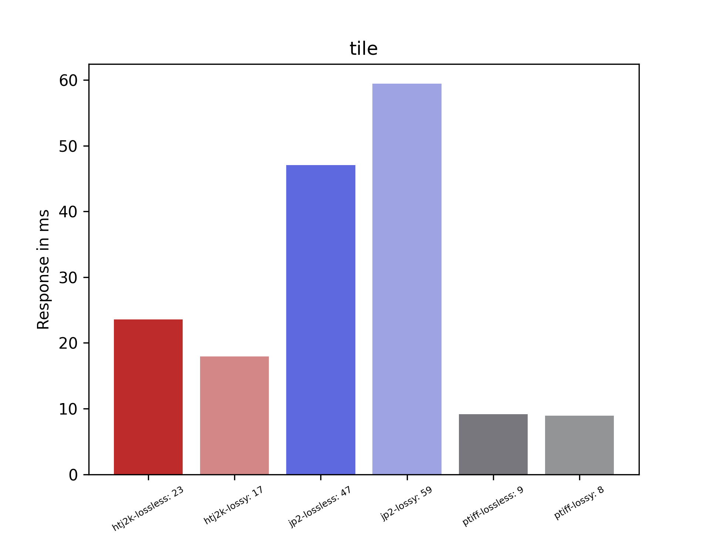
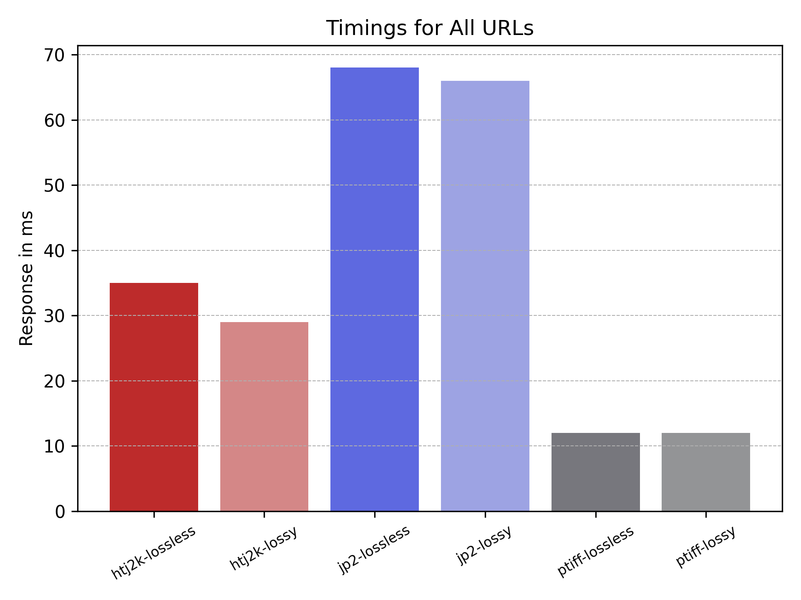
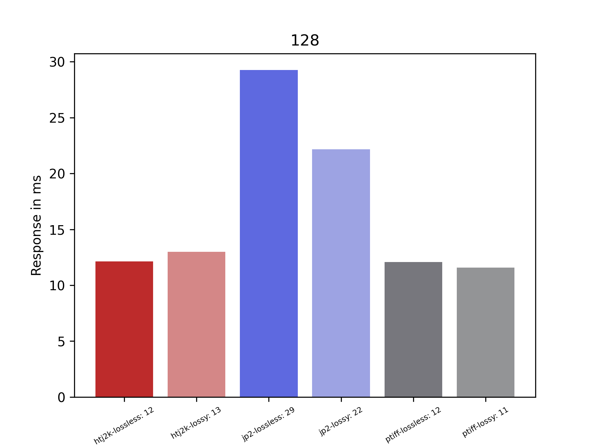
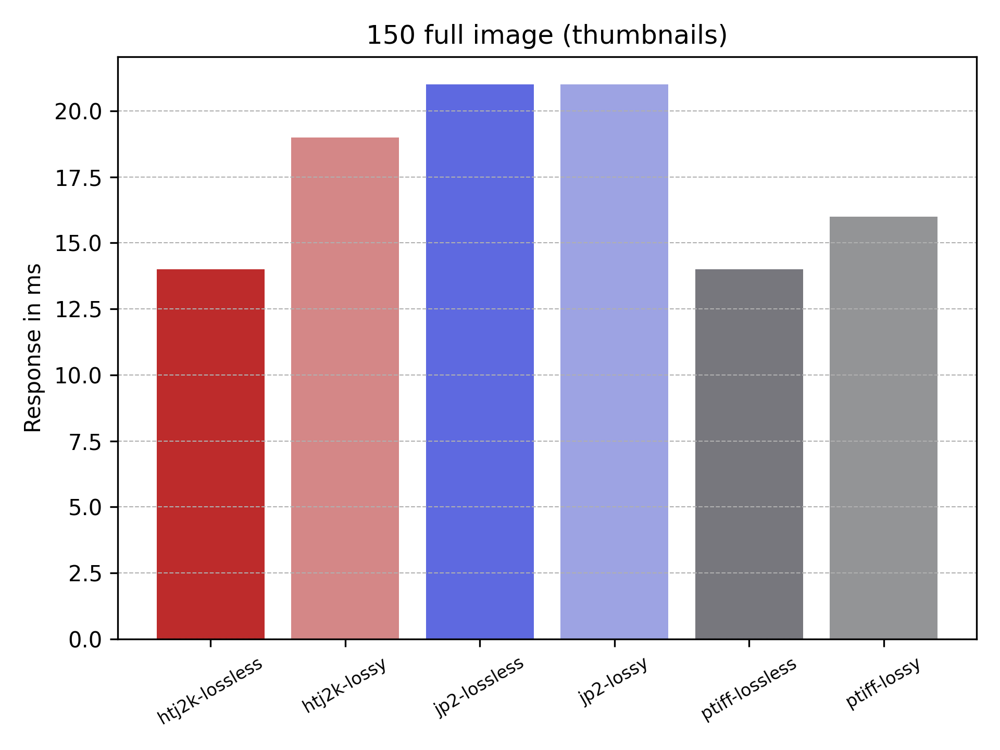
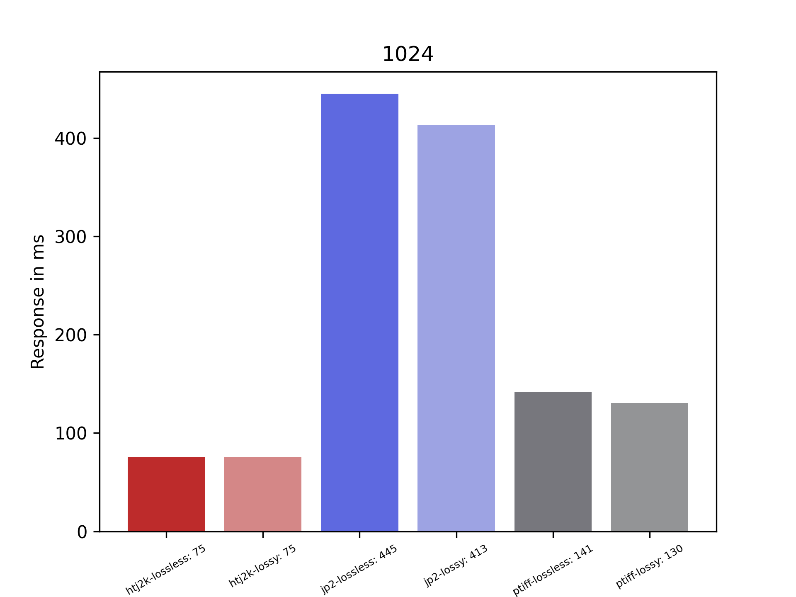
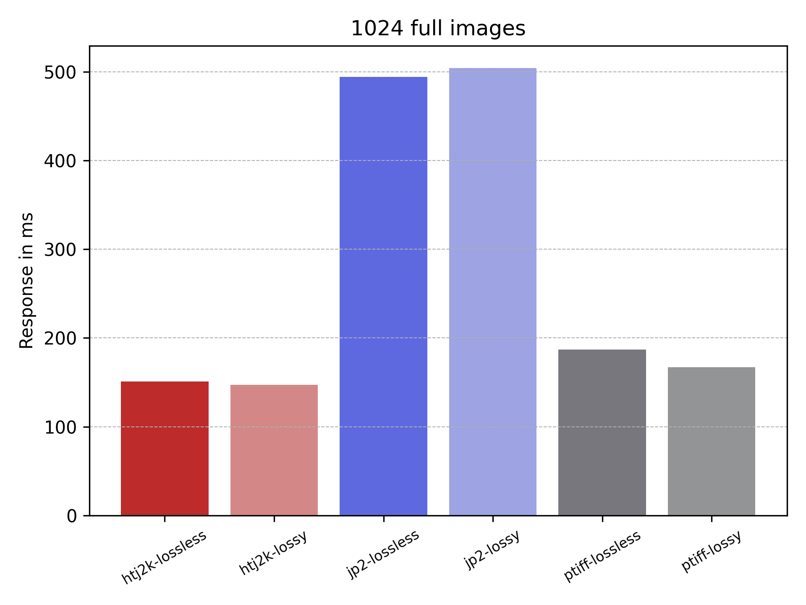
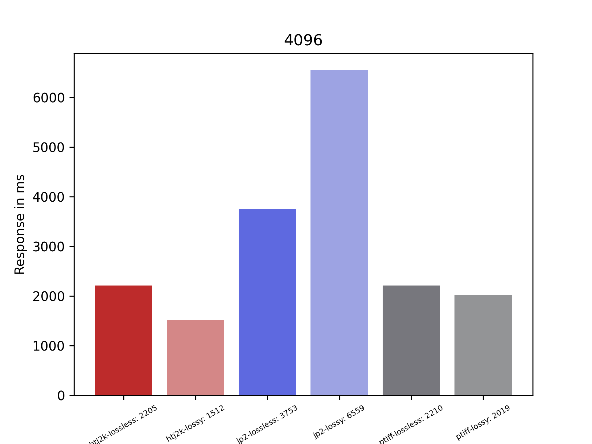
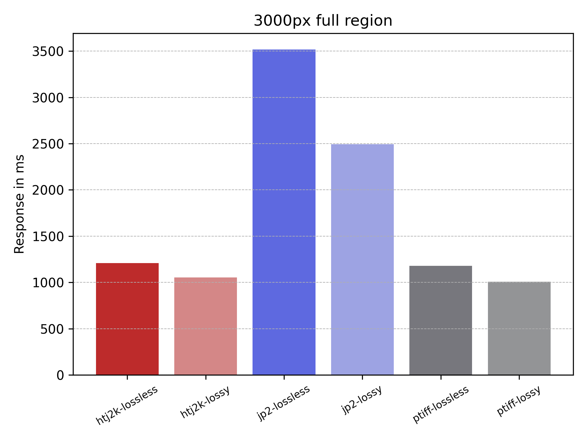
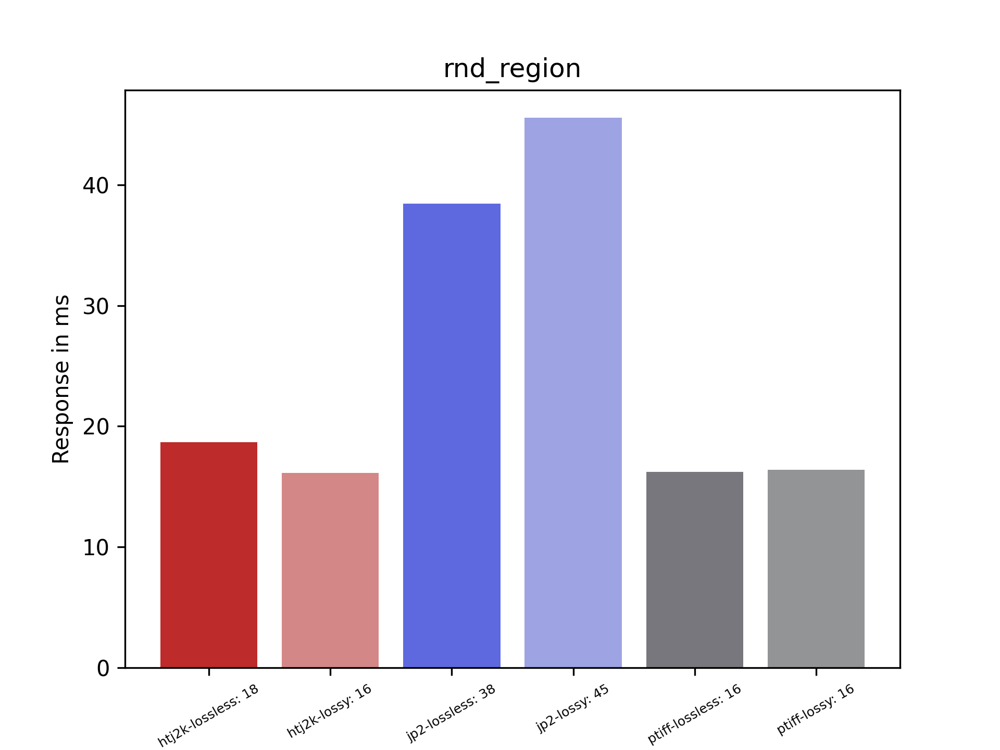
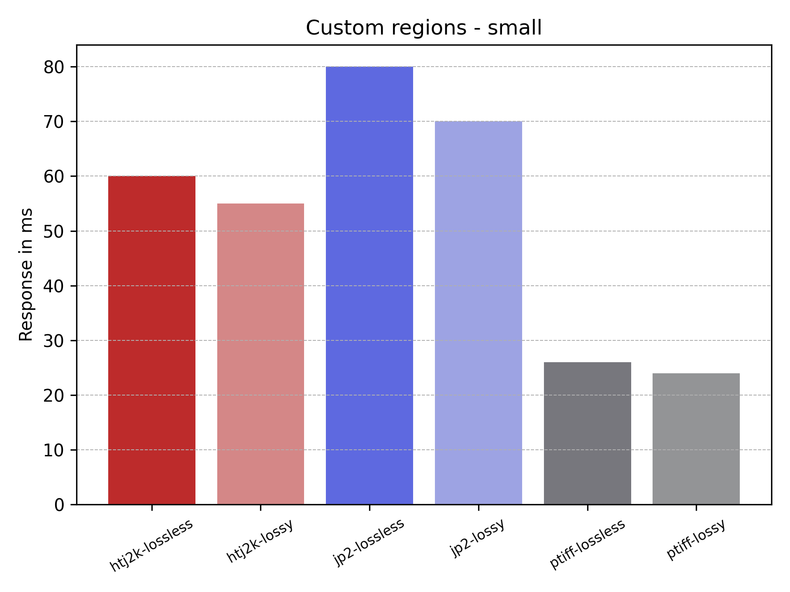

# Running Stefano's tests

## Setup

### Images

The same images were used as the previous test discussed in the [16th August 2022](../2022-08-16.md). All of the details of generation are in that post.

### IIPImage Server

This used the IIPImage setup through Stefano's Docker in the [image_server](../../../image_server) directory. I did have to make one change to revert to commit [f57b41b06ee536b6ff3aba095884107d3ffea139](https://github.com/ruven/iipsrv/commit/f57b41b06ee536b6ff3aba095884107d3ffea139) version of IIIPImage which is the version where `full/full` works. This was done in the [Dockerfile](../../../image_server/Dockerfile).

### Test scripts

Then I ran Stefano's locust script limiting:

```
LOCUST_IMG_DATASET=htj2k/lossless LOCUST_IMG_FORMAT=htj2k.jp2 locust --headless -f load_test/locustfile.py -H http://localhost:8000 -t 10m -u 1 --only-summary --csv $SCRIPT_DIR/data/htj2k-lossless
```

Where
 * LOCUST_IMG_DATASET is the type of image and for each of the six runs this changed to `['htj2k/lossless', 'htj2k/lossy', 'jp2/lossy', 'jp2/lossless', 'ptiff/lossless', 'ptiff/lossy']`
 * LOCUST_IMG_FORMAT this is the extension for the image
 * --headless run locust without GUI
 * -f [load_test/locustfile.py](../../../load_test/locustfile.py) Stefano's locust tests 
 * -H http://localhost:8000 location of the IIP Image server
 * -t 10m run tests for 10minutes and exit
 * -u 1 run with a single user
 * --only-summary print only the summary of the results rather than print the results as its going
 * --csv $SCRIPT_DIR/data/htj2k-lossless export the results to csv files in the [data](data/) directory

To keep the tests fair I created a script [runTests.sh](runTest.sh) which automates the running of the 6 runs for the different type of images.  The results for the first run is in [output.txt](output.txt).

## Results

To generate the graphs I wrote a script [mkBarChart.py](mkBarChart.py) which takes the csv results in the [data](data/) directory and generates graphs in the [charts](charts/) directory.

I will be comparing the results using Stefano's scripts with the results in [16th August 2022](../2022-08-16.md) which used different locust scripts. The main difference is in the number of requests. Stefano's scripts asks repeatedly for similar sized images where as my script only does it once per image. The numbers will be different but hopefully the trends will be reflected in both. 


### Tile regions

These are requests for tiles where the requested coordinates exactly match the tiles generated and reported in the info.json. This is by far the most common use case of IIIF which allows an image to be shown in a zoomable viewer. 

<div style="display: flex;">
  
  
</div>


### Thumbnails

These are also popular requests although different viewers request different sizes 128 pixels should be a good compromise. My tests used a 50px width image rather than 128px.

<div style="display: flex;">
  
  
</div>

### Mid sized image

This is a test of the full image but reduced to 1024px. This can be useful as a small download.

<div style="display: flex;">
  
  
</div>

### Large sized image

This is a larger full region image. In Stefano's case its 4096 but in mine it was 3000px. 

<div style="display: flex;">
  
  
</div>

### Random region

This is a more unusual use case where a user wants to request a region of a image which isn't aligned to a tile.  Stefano's images are a between 0-1024 pixels wide and tall. For mine they are 200px wide and high.

<div style="display: flex;">
  
  
</div>
