# Testing jp2 parameters 

This testing round is to test different parameters for creating jp2s to see what difference they make to decoding speeds. 

## Generating the jp2s and jph files

To generate the generation scripts I need to run the python script which will vary the number of Clevels depending on the resolution of the image. This creates all of the scripts for each config (there are 10 configs detailed in the python script)

```
#!/bin/bash
for i in $(seq 1 10); do
    python scripts/create_kdu_compress_encode_scripts.py --source_directory imgs/50/original --compressed_directory imgs/50/params --logs_directory logs --path_to_kdu_compress ./image_server/kakadu/v8_2_1-02075E/bin/Mac-x86-64-gcc/kdu_compress --output_script_filename_prefix scripts/params/ --exclude-timing --encoding_parameter_set $i;
done
```

Found in [generateAll.sh](generateAll.sh). This will generate the following scripts:

```
$ ls scripts/params/
encode_htj2k_digital_bodelian_lossless_codeblock_64,64.sh	encode_htj2k_lossy_3bpp_plt_codeblock_64,64.sh			encode_j2k1_lossless_plt_codeblock_64,64.sh
encode_htj2k_digital_bodelian_lossy_codeblock_64,64.sh		encode_htj2k_lossy_Qfactor_90_plt_codeblock_64,64.sh		encode_j2k1_lossy_3bpp_plt_codeblock_64,64.sh
encode_htj2k_lossless_codeblock_64,64.sh			encode_j2k1_digital_bodelian_lossless_codeblock_64,64.sh
encode_htj2k_lossless_plt_codeblock_64,64.sh			encode_j2k1_digital_bodelian_lossy_codeblock_64,64.sh
```

Run all these scripts by running:

```
for f in scripts/params/*.sh; do bash "$f" || break; done
```

With my parameters this will create the jp2s and htj2k files in the following directory:

```
1.9G	imgs/50/params/htj2k_lossy_3bpp_plt_codeblock_64,64
6.7G	imgs/50/params/j2k1_lossless_plt_codeblock_64,64
1.9G	imgs/50/params/htj2k_digital_bodelian_lossless_codeblock_64,64
6.7G	imgs/50/params/j2k1_digital_bodelian_lossless_codeblock_64,64
6.7G	imgs/50/params/htj2k_digital_bodelian_lossy_codeblock_64,64
7.1G	imgs/50/params/htj2k_lossless_plt_codeblock_64,64
6.7G	imgs/50/params/htj2k_lossless_codeblock_64,64
1.9G	imgs/50/params/j2k1_digital_bodelian_lossy_codeblock_64,64
1.9G	imgs/50/params/j2k1_lossy_3bpp_plt_codeblock_64,64
1.2G	imgs/50/params/htj2k_lossy_Qfactor_90_plt_codeblock_64,64
 43G	imgs/50/params
```

with 50 images per directory:

```
$ dir="imgs/50/params"; ls $dir |while read line; do echo "$line"; ls "$dir/$line" |wc -l ;done
htj2k_digital_bodelian_lossless_codeblock_64,64
      50
htj2k_digital_bodelian_lossy_codeblock_64,64
      50
htj2k_lossless_codeblock_64,64
      50
htj2k_lossless_plt_codeblock_64,64
      50
htj2k_lossy_3bpp_plt_codeblock_64,64
      50
htj2k_lossy_Qfactor_90_plt_codeblock_64,64
      50
j2k1_digital_bodelian_lossless_codeblock_64,64
      50
j2k1_digital_bodelian_lossy_codeblock_64,64
      50
j2k1_lossless_plt_codeblock_64,64
      50
j2k1_lossy_3bpp_plt_codeblock_64,64
      50
```

## Running tests

Starting docker (with new param for kakadu location):

```
docker build -t iipsrv_htj2k:latest --build-arg kakadu=./kakadu/v8_2_1-02075E . && docker run -e "IIPSRV_ENGINE=kakadu" -p 8000:8000 -v ~/development/htj2k/imgs/50:/data/images iipsrv_htj2k:latest
```

I then wrote a script to test all of the different URL files in [runAll.sh](runAll.sh). This restarts the IIPImage docker between tests and a snipit is below:

```
restartIIP
filename="info-jsons.txt"; locust -u  1 --autostart --url-list ../../data/50_images/$filename --host http://0.0.0.0:8000  --autoquit 0 --headless --only-summary --csv $SCRIPT_DIR/data/$filename 
```

## Results

Note initially this is using version [d4e1016a7f1ccb7f830db437fe9866c9d8b7173a](https://github.com/ruven/iipsrv/commit/d4e1016a7f1ccb7f830db437fe9866c9d8b7173a) of IIPImage. This is a more recent version than the version used in the [2022-08-16](../2022-08-16.md) testing.

The files used for these tests are the same ones used in the [2022-08-16](../2022-08-16.md) testing so the graphs and results should be comparable. The images marked as round1 are the same images that were used in the previous test. 

All csv files containing the full timing results are in the [data](data/) directory. All input URL files are found in the [50_images](https://github.com/IIIF/htj2k/tree/main/data/50_images) directory. 

### info.jsons

_info.jsons are requested often by IIIF clients and it contains height and width of the image and also the number and sizes of zoom levels_

The timings for this run are slightly slower than [2022-08-16](https://github.com/IIIF/htj2k/blob/main/reports/glen/2022-08-16.md#infojson-urls) 7-8ms in the last test compared to 10-12s in this test. The strange results for this run are the ptifs which are substantially slower than the previous run. Previously they were on par with the jp2 results at 8ms but in this run they average 44ms. The only change I can think that could cause this is the different IIPImage versions (Note: this is explained below but it turned out the 2202-08-16 tests were using cached info.jsons). 

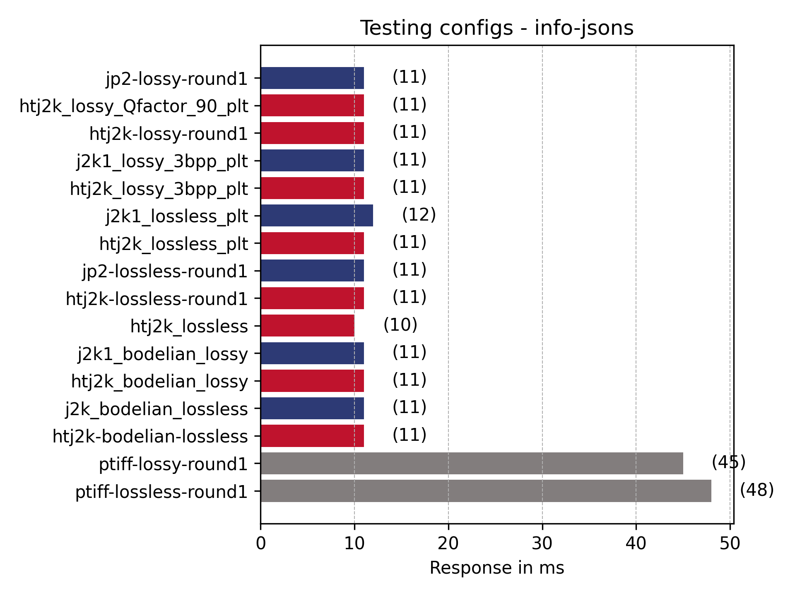

| Type | Name | Request Count | Failure Count | Median Response Time | Average Response Time | Min Response Time | Max Response Time | Average Content Size | Requests/s | Failures/s | 50% | 66% | 75% | 80% | 90% | 95% | 98% | 99% | 99.9% | 99.99% | 100% |
| --- | --- | --- | --- | --- | --- | --- | --- | --- | --- | --- | --- | --- | --- | --- | --- | --- | --- | --- | --- | --- | --- |
| GET | htj2k-bodelian-lossless | 49 | 0 | 11 | 11 | 8 | 28 | 1233 | 4 | 0 | 11 | 11 | 12 | 12 | 14 | 17 | 28 | 28 | 28 | 28 | 28 |
| GET | htj2k-lossless-round1 | 49 | 0 | 10 | 11 | 8 | 20 | 1199 | 4 | 0 | 10 | 11 | 11 | 12 | 14 | 14 | 20 | 20 | 20 | 20 | 20 |
| GET | htj2k-lossy-round1 | 49 | 0 | 10 | 11 | 7 | 21 | 1196 | 4 | 0 | 10 | 11 | 12 | 12 | 13 | 18 | 21 | 21 | 21 | 21 | 21 |
| GET | htj2k_bodelian_lossy | 49 | 0 | 10 | 11 | 7 | 19 | 1230 | 4 | 0 | 10 | 11 | 12 | 12 | 13 | 15 | 19 | 19 | 19 | 19 | 19 |
| GET | htj2k_lossless | 48 | 0 | 10 | 10 | 7 | 18 | 1216 | 4 | 0 | 10 | 11 | 11 | 12 | 13 | 15 | 18 | 18 | 18 | 18 | 18 |
| GET | htj2k_lossless_plt | 48 | 0 | 11 | 11 | 8 | 17 | 1220 | 4 | 0 | 11 | 11 | 12 | 13 | 16 | 17 | 17 | 17 | 17 | 17 | 17 |
| GET | htj2k_lossy_3bpp_plt | 48 | 0 | 10 | 11 | 8 | 22 | 1222 | 4 | 0 | 10 | 11 | 13 | 13 | 16 | 17 | 22 | 22 | 22 | 22 | 22 |
| GET | htj2k_lossy_Qfactor_90_plt | 48 | 0 | 10 | 11 | 7 | 17 | 1228 | 4 | 0 | 10 | 11 | 12 | 12 | 15 | 16 | 17 | 17 | 17 | 17 | 17 |
| GET | j2k1_bodelian_lossy | 48 | 0 | 10 | 11 | 7 | 17 | 1229 | 4 | 0 | 10 | 11 | 12 | 12 | 14 | 15 | 17 | 17 | 17 | 17 | 17 |
| GET | j2k1_lossless_plt | 48 | 0 | 10 | 12 | 7 | 24 | 1219 | 4 | 0 | 11 | 11 | 13 | 14 | 19 | 22 | 24 | 24 | 24 | 24 | 24 |
| GET | j2k1_lossy_3bpp_plt | 48 | 0 | 10 | 11 | 7 | 21 | 1221 | 4 | 0 | 10 | 11 | 12 | 12 | 14 | 19 | 21 | 21 | 21 | 21 | 21 |
| GET | j2k_bodelian_lossless | 48 | 0 | 10 | 11 | 8 | 17 | 1232 | 4 | 0 | 10 | 11 | 12 | 12 | 14 | 15 | 17 | 17 | 17 | 17 | 17 |
| GET | jp2-lossless-round1 | 49 | 0 | 10 | 11 | 7 | 27 | 1191 | 4 | 0 | 10 | 11 | 11 | 12 | 14 | 16 | 27 | 27 | 27 | 27 | 27 |
| GET | jp2-lossy-round1 | 49 | 0 | 10 | 11 | 8 | 27 | 1188 | 4 | 0 | 10 | 10 | 11 | 11 | 13 | 23 | 27 | 27 | 27 | 27 | 27 |
| GET | ptiff-lossless-round1 | 49 | 0 | 44 | 48 | 25 | 96 | 1190 | 4 | 0 | 44 | 51 | 57 | 63 | 77 | 82 | 96 | 96 | 96 | 96 | 96 |
| GET | ptiff-lossy-round1 | 49 | 0 | 44 | 45 | 25 | 93 | 1187 | 4 | 0 | 44 | 48 | 55 | 55 | 72 | 75 | 93 | 93 | 93 | 93 | 93 |
|  | Aggregated | 776 | 0 | 11 | 15 | 7 | 96 | 1212 | 65 | 0 | 11 | 12 | 13 | 15 | 31 | 48 | 65 | 76 | 96 | 96 | 96 |

Re-running the tests with the older version of IIPImage ([337aa85f46866255c27b835d69e30e562662cc72](https://github.com/ruven/iipsrv/commit/337aa85f46866255c27b835d69e30e562662cc72)) and it looks like the same timing issue with ptiff closer to 40 and the jp2s closer to 10ms.

| Type | Name | Request Count | Failure Count | Median Response Time | Average Response Time | Min Response Time | Max Response Time | Average Content Size | Requests/s | Failures/s | 50% | 66% | 75% | 80% | 90% | 95% | 98% | 99% | 99.9% | 99.99% | 100% |
| --- | --- | --- | --- | --- | --- | --- | --- | --- | --- | --- | --- | --- | --- | --- | --- | --- | --- | --- | --- | --- | --- |
| GET | htj2k-bodelian-lossless | 45 | 0 | 10 | 10 | 8 | 16 | 996 | 4 | 0 | 10 | 11 | 11 | 12 | 12 | 14 | 16 | 16 | 16 | 16 | 16 |
| GET | htj2k-lossless-round1 | 45 | 0 | 11 | 11 | 8 | 14 | 962 | 4 | 0 | 11 | 11 | 12 | 12 | 13 | 13 | 14 | 14 | 14 | 14 | 14 |
| GET | htj2k-lossy-round1 | 45 | 0 | 10 | 10 | 8 | 21 | 959 | 4 | 0 | 10 | 11 | 11 | 12 | 13 | 13 | 21 | 21 | 21 | 21 | 21 |
| GET | htj2k_bodelian_lossy | 45 | 0 | 10 | 10 | 8 | 14 | 993 | 4 | 0 | 10 | 11 | 12 | 12 | 12 | 13 | 14 | 14 | 14 | 14 | 14 |
| GET | htj2k_lossless | 45 | 0 | 10 | 11 | 8 | 22 | 979 | 4 | 0 | 10 | 11 | 12 | 13 | 14 | 16 | 22 | 22 | 22 | 22 | 22 |
| GET | htj2k_lossless_plt | 45 | 0 | 11 | 11 | 8 | 20 | 983 | 4 | 0 | 11 | 12 | 12 | 12 | 14 | 15 | 20 | 20 | 20 | 20 | 20 |
| GET | htj2k_lossy_3bpp_plt | 45 | 0 | 11 | 11 | 8 | 20 | 985 | 4 | 0 | 11 | 12 | 12 | 13 | 16 | 16 | 20 | 20 | 20 | 20 | 20 |
| GET | htj2k_lossy_Qfactor_90_plt | 45 | 0 | 10 | 12 | 8 | 30 | 991 | 4 | 0 | 10 | 11 | 12 | 12 | 13 | 18 | 30 | 30 | 30 | 30 | 30 |
| GET | j2k1_bodelian_lossy | 45 | 0 | 10 | 12 | 9 | 30 | 992 | 4 | 0 | 10 | 11 | 12 | 12 | 14 | 18 | 30 | 30 | 30 | 30 | 30 |
| GET | j2k1_lossless_plt | 45 | 0 | 11 | 11 | 8 | 17 | 982 | 4 | 0 | 11 | 12 | 13 | 14 | 15 | 15 | 17 | 17 | 17 | 17 | 17 |
| GET | j2k1_lossy_3bpp_plt | 45 | 0 | 11 | 11 | 8 | 23 | 984 | 4 | 0 | 11 | 11 | 12 | 12 | 14 | 15 | 23 | 23 | 23 | 23 | 23 |
| GET | j2k_bodelian_lossless | 45 | 0 | 10 | 11 | 8 | 19 | 995 | 4 | 0 | 10 | 11 | 12 | 12 | 13 | 15 | 19 | 19 | 19 | 19 | 19 |
| GET | jp2-lossless-round1 | 46 | 0 | 10 | 11 | 8 | 18 | 954 | 4 | 0 | 10 | 11 | 11 | 11 | 12 | 14 | 18 | 18 | 18 | 18 | 18 |
| GET | jp2-lossy-round1 | 46 | 0 | 10 | 11 | 8 | 31 | 951 | 4 | 0 | 10 | 11 | 11 | 12 | 14 | 17 | 31 | 31 | 31 | 31 | 31 |
| GET | ptiff-lossless-round1 | 46 | 0 | 42 | 44 | 27 | 79 | 956 | 4 | 0 | 42 | 49 | 50 | 51 | 62 | 67 | 79 | 79 | 79 | 79 | 79 |
| GET | ptiff-lossy-round1 | 46 | 0 | 40 | 42 | 24 | 73 | 953 | 4 | 0 | 40 | 45 | 49 | 51 | 57 | 61 | 73 | 73 | 73 | 73 | 73 |
|  | Aggregated | 724 | 0 | 11 | 15 | 8 | 79 | 976 | 66 | 0 | 11 | 12 | 13 | 14 | 33 | 44 | 53 | 61 | 79 | 79 | 79 |

Running the exact command from last time gives:

```
locust -u  1 --autostart --url-list ../../data/50_images/info-jsons.txt --host http://0.0.0.0:8000
...
Type     Name                                                                                  50%    66%    75%    80%    90%    95%    98%    99%  99.9% 99.99%   100% # reqs
--------|--------------------------------------------------------------------------------|--------|------|------|------|------|------|------|------|------|------|------|------
GET      htj2k-bodelian-lossless                                                                 8      9      9     10     12     12     20     20     20     20     20     50
GET      htj2k-lossless-round1                                                                   8      8      9     10     11     12     22     22     22     22     22     50
GET      htj2k-lossy-round1                                                                      8      9     10     11     12     13     27     27     27     27     27     50
GET      htj2k_bodelian_lossy                                                                    7      9      9     10     12     13     16     16     16     16     16     50
GET      htj2k_lossless                                                                          8      9     10     11     11     12     14     14     14     14     14     50
GET      htj2k_lossless_plt                                                                      8      9     10     11     13     14     15     15     15     15     15     50
GET      htj2k_lossy_3bpp_plt                                                                    8     10     10     11     15     17     27     27     27     27     27     50
GET      htj2k_lossy_Qfactor_90_plt                                                              7      9     11     11     12     16     20     20     20     20     20     50
GET      j2k1_bodelian_lossy                                                                     8      9     11     12     16     17     18     18     18     18     18     50
GET      j2k1_lossless_plt                                                                       8      9     10     11     13     16     18     18     18     18     18     50
GET      j2k1_lossy_3bpp_plt                                                                     9     10     10     11     12     14     16     16     16     16     16     50
GET      j2k_bodelian_lossless                                                                   9     10     10     11     14     19     28     28     28     28     28     50
GET      jp2-lossless-round1                                                                     8      9      9      9     11     12     15     15     15     15     15     50
GET      jp2-lossy-round1                                                                        8      9      9     10     11     12     65     65     65     65     65     50
GET      ptiff-lossless-round1                                                                   8      9     10     10     13     13     15     15     15     15     15     50
GET      ptiff-lossy-round1                                                                      8     10     10     11     13     16     19     19     19     19     19     50
--------|--------------------------------------------------------------------------------|--------|------|------|------|------|------|------|------|------|------|------|------
         Aggregated                                                                              8      9     10     10     12     14     17     20     65     65     65    800
```

which is similar to the previous results so I think this is due to a caching issue. Looking at my previous tests I didn't restart IIPImage between tests so it looks like the info.jsons are cached and the timings above are getting the info.jsons from the cache rather than re-generating them. If I restart the IIPImage server and run the same command I get:

```
Type     Name                                                                          # reqs      # fails |    Avg     Min     Max    Med |   req/s  failures/s
--------|----------------------------------------------------------------------------|-------|-------------|-------|-------|-------|-------|--------|-----------
GET      htj2k-bodelian-lossless                                                           50     0(0.00%) |     13       9      29     13 |    3.61        0.00
GET      htj2k-lossless-round1                                                             50     0(0.00%) |     13       9      35     12 |    3.61        0.00
GET      htj2k-lossy-round1                                                                50     0(0.00%) |     12       8      26     11 |    3.61        0.00
GET      htj2k_bodelian_lossy                                                              50     0(0.00%) |     12       9      21     12 |    3.61        0.00
GET      htj2k_lossless                                                                    50     0(0.00%) |     13       9      28     13 |    3.61        0.00
GET      htj2k_lossless_plt                                                                50     0(0.00%) |     13       9      21     13 |    3.61        0.00
GET      htj2k_lossy_3bpp_plt                                                              50     0(0.00%) |     13       9      34     12 |    3.61        0.00
GET      htj2k_lossy_Qfactor_90_plt                                                        50     0(0.00%) |     13       9      25     13 |    3.61        0.00
GET      j2k1_bodelian_lossy                                                               50     0(0.00%) |     13       9      20     13 |    3.61        0.00
GET      j2k1_lossless_plt                                                                 50     0(0.00%) |     13       8      21     13 |    3.61        0.00
GET      j2k1_lossy_3bpp_plt                                                               50     0(0.00%) |     12       8      21     12 |    3.61        0.00
GET      j2k_bodelian_lossless                                                             50     0(0.00%) |     13       8      25     12 |    3.61        0.00
GET      jp2-lossless-round1                                                               50     0(0.00%) |     12       8      21     12 |    3.61        0.00
GET      jp2-lossy-round1                                                                  50     0(0.00%) |     13       7      24     13 |    3.61        0.00
GET      ptiff-lossless-round1                                                             50     0(0.00%) |     45      26      84     44 |    3.61        0.00
GET      ptiff-lossy-round1                                                                50     0(0.00%) |     44      23      85     43 |    3.61        0.00
--------|----------------------------------------------------------------------------|-------|-------------|-------|-------|-------|-------|--------|-----------
         Aggregated                                                                       800     0(0.00%) |     17       7      85     13 |   57.76        0.00
```

#### Tile URLs (iiif_urls_unique)

_tile images are the most commonly requested image from IIIF viewers. As a user zooms into an image the IIIF viewer will request more detailed tiles_

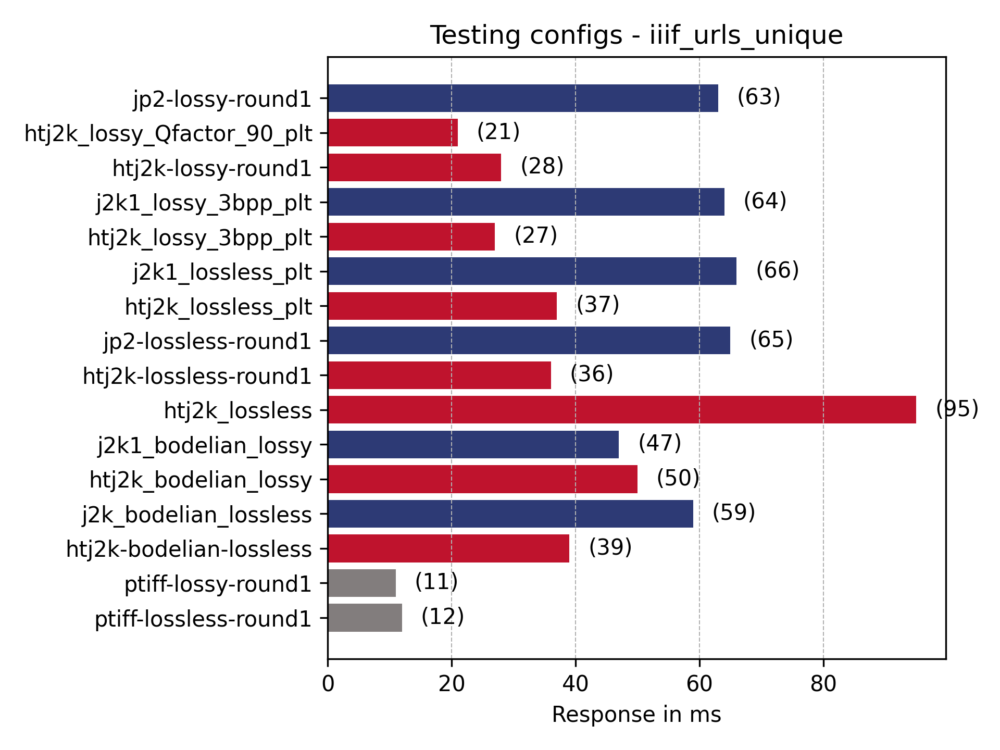

Results for the round 1 images are very close to the [2022-08-16](https://github.com/IIIF/htj2k/blob/main/reports/glen/2022-08-16.md#all-urls) results. 

htj2k-lossless is clearly the slowest (95ms). This is mainly due to the lack of the PLT metadata headers which allow quick navigation. This can be compared with htj2k_lossless_plt (37ms) and htj2k-lossy-round1 (36ms) which both have plt. 

Generally htj2k is faster than the corresponding jp2 apart from j2k1_Bodleian_lossy (47ms) and htj2k_Bodleian_lossy (50ms).

j2k Bodleian lossy: 
 * "Cprecincts={256,256},{256,256},{128,128}" 
 * "Stiles={512,512}" 
 * Corder=RPCL 
 * ORGgen_plt=yes 
 * ORGtparts=R 
 * "Cblk={64,64}" 
 * Cuse_sop=yes 
 * Cuse_eph=yes 
 * -flush_period 1024 
 * -rate 3 
 * Clevels=7 

htj2k bodelian lossy: 
 * "Cprecincts={256,256},{256,256},{128,128}" 
 * "Stiles={512,512}" 
 * Corder=RPCL 
 * ORGgen_plt=yes 
 * ORGtparts=R 
 * "Cblk={64,64}" 
 * Cuse_sop=yes 
 * Cuse_eph=yes 
 * -flush_period 1024 
 * **Creversible=yes** 
 * **Cmodes=HT** 
 * **-rate -**
 * Clevels=7 

I wonder if the rate should be `-` and if this is causing the issue. Looking at the script `create_kdu_compress_encode_script.py` there are two files which have a rate as dash `j2k1_bodelian_lossless` (59ms) and `htj2k_bodelian_lossy`.

The only other thing that comes out of these results is the speed up when compressing as lossy with QFactor (`Qfactor=90`). In the previous tests we used a bits per pixel which generates a predictable sized jp2. A Qfactor compression will change the size of the file depending on how complicated the image is to compress. See the sizes at the top of the page but for the test images qfactor compression actually created smaller jp2s. 

| Type | Name | Request Count | Failure Count | Median Response Time | Average Response Time | Min Response Time | Max Response Time | Average Content Size | Requests/s | Failures/s | 50% | 66% | 75% | 80% | 90% | 95% | 98% | 99% | 99.9% | 99.99% | 100% |
| --- | --- | --- | --- | --- | --- | --- | --- | --- | --- | --- | --- | --- | --- | --- | --- | --- | --- | --- | --- | --- | --- |
| GET | htj2k-bodelian-lossless | 3084 | 0 | 17 | 39 | 5 | 8806 | 17099 | 1 | 0 | 17 | 21 | 24 | 26 | 35 | 54 | 290 | 560 | 2100 | 8800 | 8800 |
| GET | htj2k-lossless-round1 | 3084 | 0 | 24 | 36 | 5 | 192 | 19363 | 1 | 0 | 24 | 41 | 53 | 60 | 81 | 99 | 120 | 140 | 170 | 190 | 190 |
| GET | htj2k-lossy-round1 | 3084 | 0 | 20 | 28 | 5 | 145 | 17101 | 1 | 0 | 20 | 30 | 38 | 43 | 57 | 69 | 85 | 100 | 130 | 150 | 150 |
| GET | htj2k_bodelian_lossy | 3084 | 0 | 21 | 50 | 6 | 11857 | 19363 | 1 | 0 | 21 | 27 | 31 | 35 | 47 | 65 | 360 | 740 | 2400 | 12000 | 12000 |
| GET | htj2k_lossless | 3084 | 0 | 25 | 95 | 5 | 13324 | 19363 | 1 | 0 | 25 | 50 | 73 | 97 | 170 | 300 | 730 | 1200 | 4300 | 13000 | 13000 |
| GET | htj2k_lossless_plt | 3084 | 0 | 25 | 37 | 5 | 267 | 19363 | 1 | 0 | 25 | 42 | 54 | 62 | 81 | 99 | 120 | 140 | 180 | 270 | 270 |
| GET | htj2k_lossy_3bpp_plt | 3084 | 0 | 20 | 27 | 6 | 158 | 17101 | 1 | 0 | 20 | 29 | 36 | 41 | 56 | 66 | 87 | 100 | 140 | 160 | 160 |
| GET | htj2k_lossy_Qfactor_90_plt | 3084 | 0 | 15 | 21 | 5 | 176 | 16951 | 1 | 0 | 15 | 20 | 26 | 31 | 43 | 57 | 77 | 91 | 130 | 180 | 180 |
| GET | j2k1_bodelian_lossy | 3084 | 0 | 25 | 47 | 6 | 9151 | 17117 | 1 | 0 | 25 | 30 | 33 | 35 | 46 | 64 | 320 | 560 | 2000 | 9200 | 9200 |
| GET | j2k1_lossless_plt | 3084 | 0 | 60 | 66 | 7 | 263 | 19363 | 1 | 0 | 60 | 76 | 87 | 95 | 120 | 140 | 160 | 180 | 230 | 260 | 260 |
| GET | j2k1_lossy_3bpp_plt | 3083 | 0 | 62 | 64 | 10 | 260 | 17111 | 1 | 0 | 62 | 74 | 82 | 87 | 100 | 110 | 130 | 150 | 200 | 260 | 260 |
| GET | j2k_bodelian_lossless | 3084 | 0 | 29 | 59 | 5 | 10978 | 19363 | 1 | 0 | 29 | 37 | 44 | 49 | 64 | 86 | 370 | 700 | 2400 | 11000 | 11000 |
| GET | jp2-lossless-round1 | 3084 | 0 | 59 | 65 | 7 | 242 | 19363 | 1 | 0 | 59 | 74 | 85 | 93 | 120 | 130 | 160 | 170 | 210 | 240 | 240 |
| GET | jp2-lossy-round1 | 3084 | 0 | 61 | 63 | 9 | 243 | 17112 | 1 | 0 | 61 | 73 | 81 | 86 | 100 | 110 | 130 | 140 | 190 | 240 | 240 |
| GET | ptiff-lossless-round1 | 3084 | 0 | 11 | 12 | 5 | 86 | 16872 | 1 | 0 | 11 | 13 | 14 | 15 | 18 | 22 | 29 | 44 | 76 | 86 | 86 |
| GET | ptiff-lossy-round1 | 3084 | 0 | 10 | 11 | 4 | 89 | 16959 | 1 | 0 | 10 | 11 | 13 | 13 | 16 | 18 | 24 | 43 | 70 | 89 | 89 |
|  | Aggregated | 49343 | 0 | 25 | 45 | 4 | 13324 | 18060 | 22 | 0 | 25 | 39 | 51 | 60 | 84 | 110 | 150 | 250 | 1500 | 8800 | 13000 |

### Full region at different sizes

_The smaller sized full region requests are commonly requested by IIIF clients like the Universal Viewer and Mirador. Larger image requests are usually requested by users and would be less common and only if a user requested to download an image._

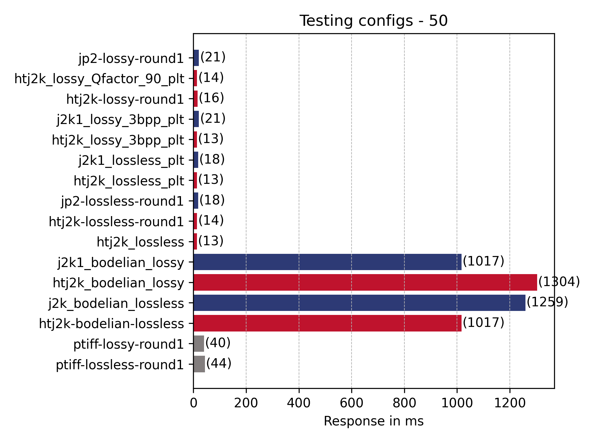

Round 1 tests comparisons and ptiff seems to be a lot slower:

| File | Run 1  (ms)| Run 2 (ms)|
| --- | --- | --- |
| Htj2k-lossless | 14 |  14 | 
| Htj2k-lossy |  19 | 16 |
|  jp2-lossless | 21 | 18 |
|  jp2-lossy | 21 | 16 | 
|  ptiff-lossless | 14 | 40 |
|  ptiff-lossy | 16 | 44  |  

Rerunning previous test with older verison IIPImage and a restart:

```
Type     Name                                                                          # reqs      # fails |    Avg     Min     Max    Med |   req/s  failures/s
--------|----------------------------------------------------------------------------|-------|-------------|-------|-------|-------|-------|--------|-----------
GET      ptiff-lossless-round1                                                             50     0(0.00%) |     74      34     131     72 |    0.12        0.00
GET      ptiff-lossy-round1                                                                50     0(0.00%) |     70      33     132     68 |    0.12        0.00
```

Rerunning previous test without restart, there is obviously some caching going on:

```
Type     Name                                                                          # reqs      # fails |    Avg     Min     Max    Med |   req/s  failures/s
--------|----------------------------------------------------------------------------|-------|-------------|-------|-------|-------|-------|--------|-----------
GET      ptiff-lossless-round1                                                             50     0(0.00%) |     12       8      17     12 |    2.12        0.00
GET      ptiff-lossy-round1                                                                50     0(0.00%) |     11       6      20     12 |    2.12        0.00
```

Restart, get all info.json then run 50px images. This matches the results from Run 1 so I think this is what happened previously and the info.json is cached in some way making the ptiff thumbnails artificially faster. 

```
Type     Name                                                                          # reqs      # fails |    Avg     Min     Max    Med |   req/s  failures/s
--------|----------------------------------------------------------------------------|-------|-------------|-------|-------|-------|-------|--------|-----------
GET      htj2k-lossless-round1                                                             50     0(0.00%) |     15       8      27     15 |    0.13        0.00
GET      htj2k-lossy-round1                                                                50     0(0.00%) |     19       9      35     19 |    0.13        0.00
GET      jp2-lossless-round1                                                               50     0(0.00%) |     22      12      39     20 |    0.13        0.00
GET      jp2-lossy-round1                                                                  50     0(0.00%) |     29      15      48     28 |    0.13        0.00
GET      ptiff-lossless-round1                                                             50     0(0.00%) |     14       6      27     12 |    0.13        0.00
GET      ptiff-lossy-round1                                                                50     0(0.00%) |     14       8      31     13 |    0.13        0.00
```

The other thing that jumps out from this graph is how amazingly slow the Bodelian profile is for this type of request all most x100 slower... The other jp2s are generally around the same speed. The fastest is htj2k_lossless,  htj2k_lossless_plt and htj2k_lossy_3bpp_plt.

#### 500px wide image

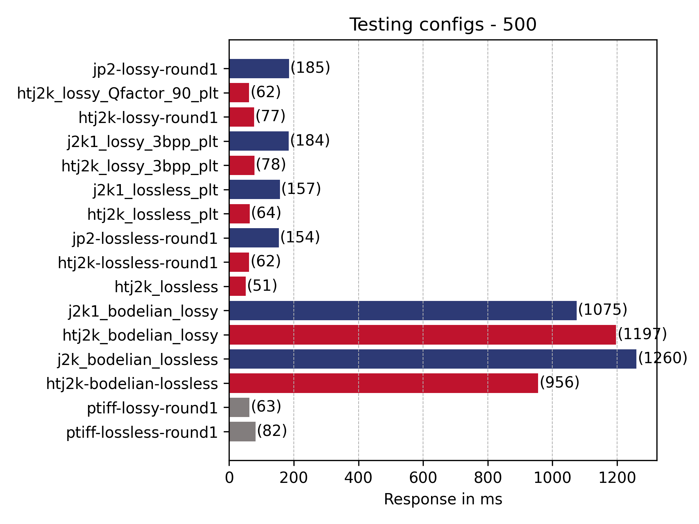

Comparison with run 1:
| File | Run 1  (ms)| Run 2 (ms)|
| --- | --- | --- |
| htj2k-lossless  | 47 | 62 | 
| htj2k-lossy   | 49 | 77 |
| jp2-lossless   | 130 | 154 |   
| jp2-lossy  | 156 | 185 |
| ptiff-lossless  | 65 | 82 |
| ptiff-lossy  | 61 | 63 |

Everything is a bit slower which could be down to testing more images and IIPImage not clearing out any residual memory or cache from previous requests. Running on the older version of IIPImage:

```
Type     Name                                                                          # reqs      # fails |    Avg     Min     Max    Med |   req/s  failures/s
--------|----------------------------------------------------------------------------|-------|-------------|-------|-------|-------|-------|--------|-----------
GET      htj2k-lossless-round1                                                             50     0(0.00%) |    104      31     301     75 |    0.10        0.00
GET      htj2k-lossy-round1                                                                50     0(0.00%) |    127      45     388    100 |    0.10        0.00
GET      jp2-lossless-round1                                                               50     0(0.00%) |    206      51     719    140 |    0.10        0.00
GET      jp2-lossy-round1                                                                  50     0(0.00%) |    260      69    1108    170 |    0.10        0.00
GET      ptiff-lossless-round1                                                             50     0(0.00%) |    139      70     314    120 |    0.10        0.00
GET      ptiff-lossy-round1                                                                50     0(0.00%) |    111      55     219     94 |    0.10        0.00
```
Reboot iipimage, info.json run and the 500 back to similar times to run 1:
```
Type     Name                                                                          # reqs      # fails |    Avg     Min     Max    Med |   req/s  failures/s
--------|----------------------------------------------------------------------------|-------|-------------|-------|-------|-------|-------|--------|-----------
GET      htj2k-lossless-round1                                                             50     0(0.00%) |     68      16     186     57 |    0.14        0.00
GET      htj2k-lossy-round1                                                                50     0(0.00%) |     86      37     264     76 |    0.14        0.00
GET      jp2-lossless-round1                                                               50     0(0.00%) |    151      26     415    110 |    0.14        0.00
GET      jp2-lossy-round1                                                                  50     0(0.00%) |    192      40     622    140 |    0.14        0.00
GET      ptiff-lossless-round1                                                             50     0(0.00%) |     60      19     175     53 |    0.14        0.00
GET      ptiff-lossy-round1                                                                50     0(0.00%) |     43      11     131     37 |    0.14        0.00
```

Reboot IIPImage, removing bodelian images and then running without info.json pre-run similar results:
```
Type     Name                                                                          # reqs      # fails |    Avg     Min     Max    Med |   req/s  failures/s
--------|----------------------------------------------------------------------------|-------|-------------|-------|-------|-------|-------|--------|-----------
GET      htj2k-lossless-round1                                                             50     0(0.00%) |     58      23     171     48 |    0.87        0.00
GET      htj2k-lossy-round1                                                                50     0(0.00%) |     73      29     197     59 |    0.87        0.00
GET      htj2k_lossless                                                                    50     0(0.00%) |     48      19     107     42 |    0.87        0.00
GET      htj2k_lossless_plt                                                                50     0(0.00%) |     59      23     169     49 |    0.87        0.00
GET      htj2k_lossy_3bpp_plt                                                              50     0(0.00%) |     75      36     227     61 |    0.87        0.00
GET      htj2k_lossy_Qfactor_90_plt                                                        50     0(0.00%) |     61      20     184     48 |    0.87        0.00
GET      j2k1_lossless_plt                                                                 50     0(0.00%) |    137      39     404     91 |    0.87        0.00
GET      j2k1_lossy_3bpp_plt                                                               50     0(0.00%) |    163      44     531    120 |    0.87        0.00
GET      jp2-lossless-round1                                                               50     0(0.00%) |    135      32     395     90 |    0.87        0.00
GET      jp2-lossy-round1                                                                  50     0(0.00%) |    169      50     531    120 |    0.87        0.00
GET      ptiff-lossless-round1                                                             50     0(0.00%) |     90      43     449     82 |    0.87        0.00
GET      ptiff-lossy-round1                                                                50     0(0.00%) |     68      39     177     66 |    0.87        0.00
```

### 1024 pixel image

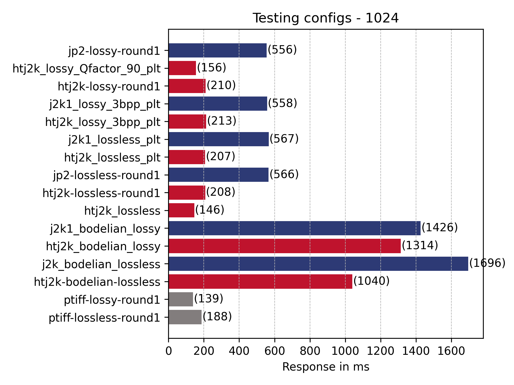

Similar shape to above.

### 3000 pixel image

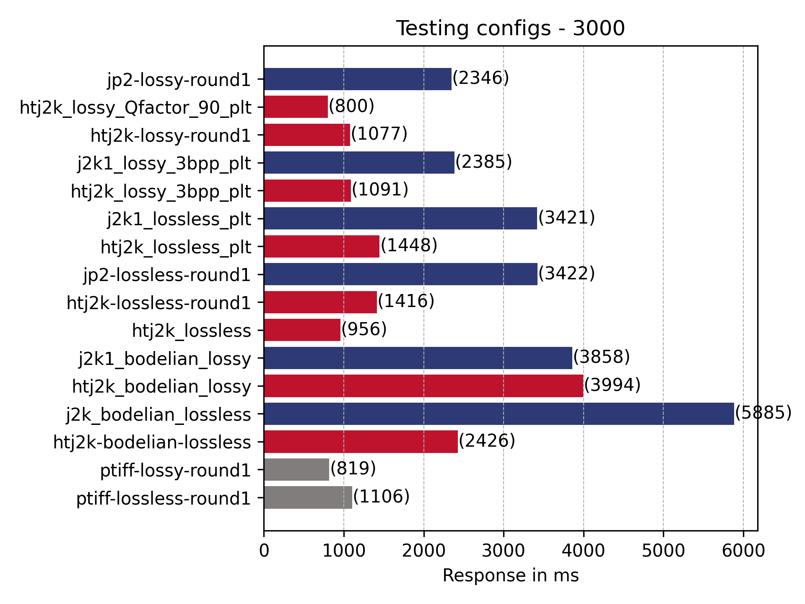

ht starting to show its benefits. htj2k_bodelian_lossless starting to become competitive. 

#### Full sized image

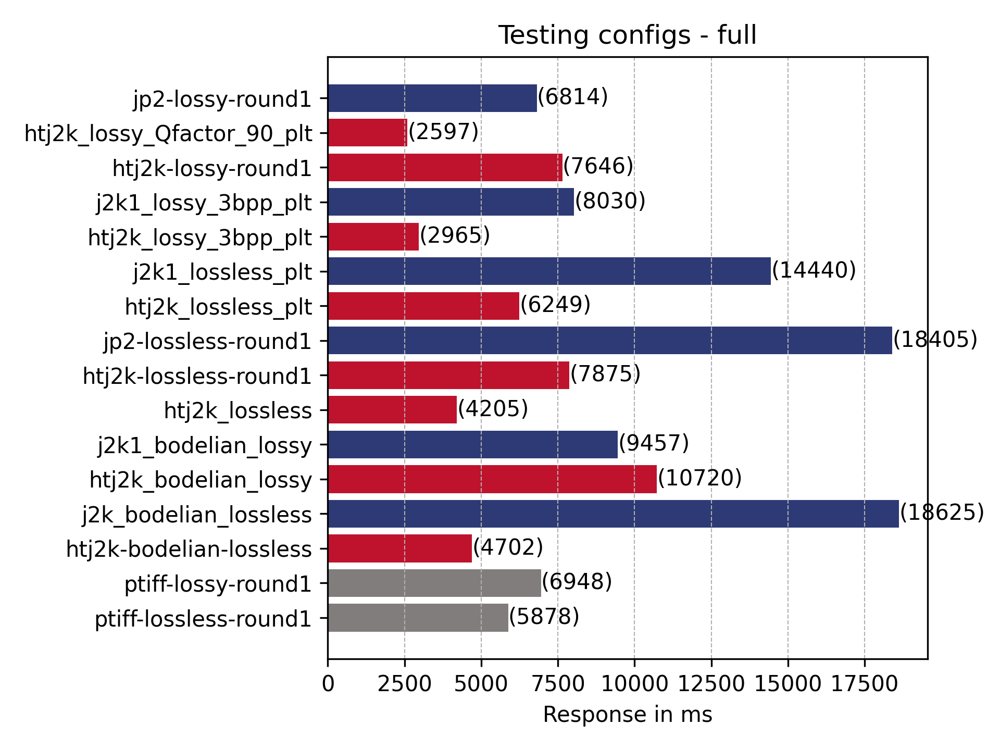

All responses quite slow. QFactor and lossy moving ahead. htj2k_bodelian_lossless a lot quicker than in previous tests. 

Note there were the following failures:

| Method | Name | Error | Occurrences |
| --- | --- | --- | --- |
| GET | j2k1_lossless_plt | HTTPError('504 Server Error: Gateway Time-out for url: j2k1_lossless_plt') | 1 |
| GET | j2k_bodelian_lossless | HTTPError('504 Server Error: Gateway Time-out for url: j2k_bodelian_lossless') | 1 |
| GET | jp2-lossless-round1 | HTTPError('504 Server Error: Gateway Time-out for url: jp2-lossless-round1') | 2 |
| GET | j2k1_lossy_3bpp_plt | HTTPError('504 Server Error: Gateway Time-out for url: j2k1_lossy_3bpp_plt') | 1 |
| GET | j2k1_bodelian_lossy | HTTPError('504 Server Error: Gateway Time-out for url: j2k1_bodelian_lossy') | 1 |
| GET | htj2k-lossy-round1 | HTTPError('504 Server Error: Gateway Time-out for url: htj2k-lossy-round1') | 1 |

and only 41 images tested rather than the full 50.

Summary
 * plt makes less of a different with full region
 * jp2 + htj2k quicker at smaller resolutions but difference not so much as you get above 500px 
 * QFactor write up there

### UV 

_This is one of the popular IIIF viewers. The URLs have been generated by creating a manifest with all 50 images in and then navigating between all of the images and zooming around the first few images._

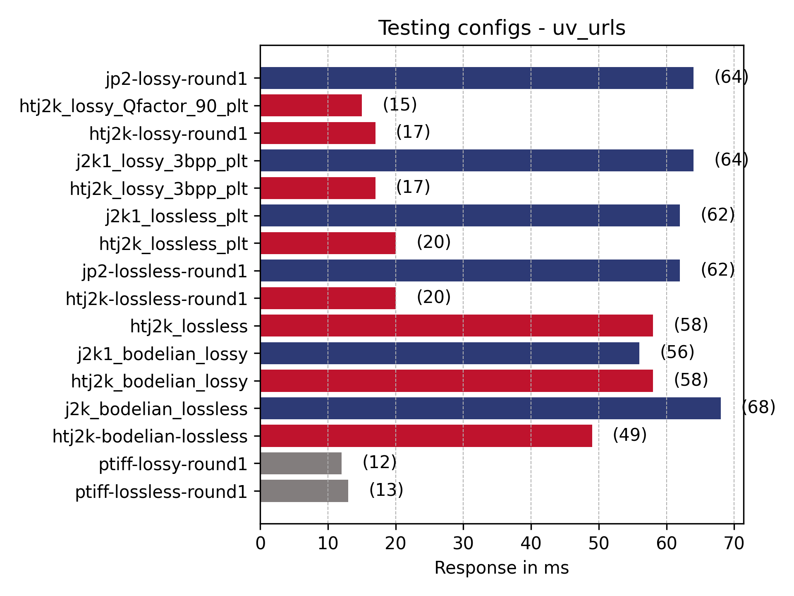

Comparison with run 1:
| File | Run 1  (ms)| Run 2 (ms)|
| --- | --- | --- |
| htj2k-lossless |     26 | 20 |
| htj2k-lossy |     24    |  17 |
| jp2-lossless |     72   | 62 |
| jp2-lossy |     63   | 61 | 
| ptiff-lossless |     18 |  12 |
| ptiff-lossy |     19   |  13 |

Observations:
 * PLT makes a difference
 * ptiff fastest then htj2k  
 * lossy much faster than lossless 
 * QFactor slightly faster

### Mirador

_This is another popular IIIF viewers. The URLs have been generated by creating a manifest with all 50 images in and then navigating between all of the images and zooming around the first few images._

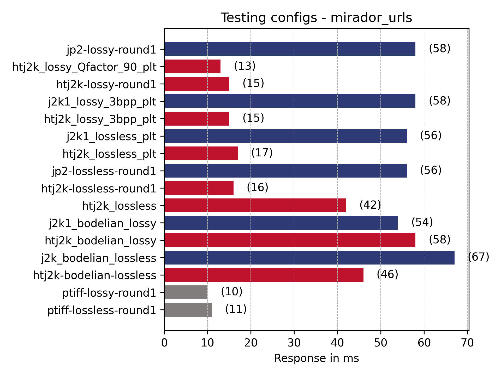

Comparison with run 1:
| File | Run 1  (ms)| Run 2 (ms)|
| --- | --- | --- |
| htj2k-lossless  |     23  |  16 | 
| htj2k-lossy  |     21      |  15 |
| jp2-lossless  |     66    | 56 | 
| jp2-lossy  |     60      | 58 | 
| ptiff-lossless |     17  | 11 | 
| ptiff-lossy |     18     |  10 |

Observations:
 * PLT makes a difference
 * ptiff fastest then htj2k  
 * lossy much faster than lossless 
 * QFactor slightly faster

### Random non-tile regions

_This list of URLs are for regions of an image that don't match up with a tile. This is possible with IIIF if you use a image cropying tool but isn't very common. If you use an image cropying tool you will get the URL and this URL might be requested a lot if its tweeted or put on a blog but a usual image server wouldn't get many of these requests compared to full region or tile requests_

#### Small regions (100,100 by 200,200)

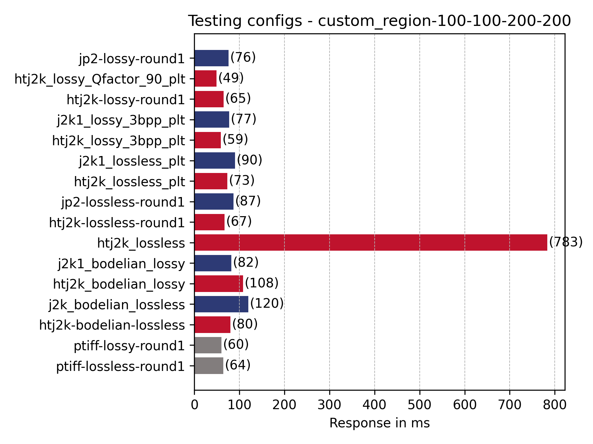

Comparison with run 1:
| File | Run 1  (ms)| Run 2 (ms)|
| --- | --- | --- |
| htj2k-lossless  |     60   |  67 | 
| htj2k-lossy  |     55    | 65 |
| jp2-lossless  |     80    | 87 |
| jp2-lossy  |     70   | 76 | 
| ptiff-lossless  |     26  |   64 | 
| ptiff-lossy  |     24   |  60 | 

Observations:
 * PLT clearly makes a big difference! 
 * jp2 + htj2k + ptiff similar for this use case
 * QFactor fastest

 ### Large regions (100,100 by 2000,2000)

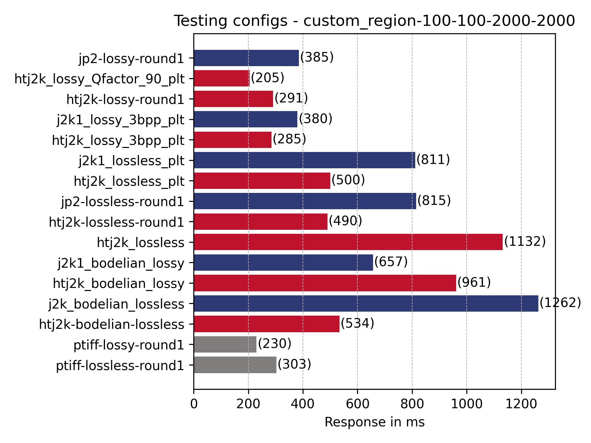

Comparison with run 1:
| File | Run 1  (ms)| Run 2 (ms)|
| --- | --- | --- |
|      htj2k-lossless  |    380 | 490 |
|      htj2k-lossy |    242  | 291 |
|      jp2-lossless |    735 | 815 |
|      jp2-lossy |    347 | 385 | 
|      ptiff-lossless |    265  | 303 |
|      ptiff-lossy |    248   | 230 |

Observations:
 * Lossy quicker
 * PLT makes a difference 
 * QFactor fastest 

## Questions

1. In `create_kdu_compress_encode_script.py` should j2k1_digital_bodelian_lossless_codeblock and htj2k_digital_Bodleian_lossy_codeblock have `-rate -`?
2. Why is the Bodleian profile so slow for 50px thumbnails? 