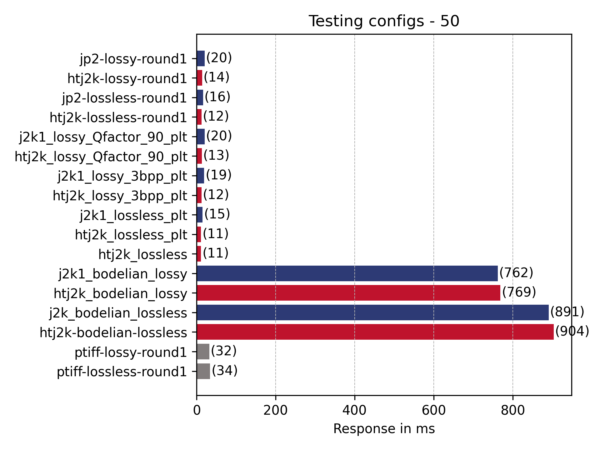

# Testing jp2k parameters 

Re-running tests now generation script has been [fixed]().

## Generating the jp2s and htj2k jp2s

Ran [generateScripts.sh](generateScripts.sh) to create the scripts in [scripts](scripts/):

```
./generateScripts.sh

ls scripts/

encode_htj2k_digital_bodelian_lossless_codeblock_64,64.sh	encode_htj2k_lossy_3bpp_plt_codeblock_64,64.sh			encode_j2k1_lossless_plt_codeblock_64,64.sh
encode_htj2k_digital_bodelian_lossy_codeblock_64,64.sh		encode_htj2k_lossy_Qfactor_90_plt_codeblock_64,64.sh		encode_j2k1_lossy_3bpp_plt_codeblock_64,64.sh
encode_htj2k_lossless_codeblock_64,64.sh			encode_j2k1_digital_bodelian_lossless_codeblock_64,64.sh
encode_htj2k_lossless_plt_codeblock_64,64.sh			encode_j2k1_digital_bodelian_lossy_codeblock_64,64.sh
```

Run all these scripts by running:

```
for f in scripts/*.sh; do bash "$f" || break; done
```

This creates the following directories:

```
1.9G	../../../imgs/50/params2/htj2k_lossy_3bpp_plt_codeblock_64,64
1.1G	../../../imgs/50/params2/j2k1_lossy_Qfactor_90_plt_codeblock_64,64
1.2G	../../../imgs/50/params2/htj2k_lossy_Qfactor_90_codeblock_64,64
6.5G	../../../imgs/50/params2/j2k1_lossless_plt_codeblock_64,64
6.7G	../../../imgs/50/params2/htj2k_digital_bodelian_lossless_codeblock_64,64
6.5G	../../../imgs/50/params2/j2k1_digital_bodelian_lossless_codeblock_64,64
1.9G	../../../imgs/50/params2/htj2k_digital_bodelian_lossy_codeblock_64,64
6.7G	../../../imgs/50/params2/htj2k_lossless_plt_codeblock_64,64
6.7G	../../../imgs/50/params2/htj2k_lossless_codeblock_64,64
1.9G	../../../imgs/50/params2/j2k1_digital_bodelian_lossy_codeblock_64,64
1.9G	../../../imgs/50/params2/j2k1_lossy_3bpp_plt_codeblock_64,64
1.2G	../../../imgs/50/params2/htj2k_lossy_Qfactor_90_plt_codeblock_64,64
# Original Tiff files:
15G	../../../imgs/50/original/
```

## Running tests

I created a script [runAll.sh](runAll.sh) which started and stopped the Docker instance between tests. It also ran all of the different URL files and generated the Graphs. I also extracted the images that require testing to [images.json](images.json) so the locust scripts didn't need to be edited. 

The tests were using the [Broken version of IIPImage](https://github.com/ruven/iipsrv/commit/337aa85f46866255c27b835d69e30e562662cc72). This contains the fix the full/full issue identified in the first set of testing. 

The files used for these tests are the same ones used in the [2022-08-16](../2022-08-16.md) testing so the graphs and results should be comparable. The images marked as round1 are the same images that were used in the previous test. 

All csv files containing the full timing results are in the [data](data/) directory. All input URL files are found in the [50_images](https://github.com/IIIF/htj2k/tree/main/data/50_images) directory. All charts are in the [charts](charts/) directory. 

### info.jsons

_info.jsons are requested often by IIIF clients and it contains height and width of the image and also the number and sizes of zoom levels_

Results broadly similar to the [last round](../2023-05-23/README.md) of testing. The ptiff is slower than jp2 for creating the info.json but this is heavily cached with IIPimage. 


### Tile URLs (iiif_urls_unique)

_tile images are the most commonly requested image from IIIF viewers. As a user zooms into an image the IIIF viewer will request more detailed tiles_

Summary of results:
 
 * pTiff clearly quicker for this interaction. 
 * Clearly PLT makes a big difference. 
 * Interestingly j2k1 QFactor 90 and the Bodleian jp2 lossy are the same. 
 * Lossy QFactor is quickest for both ht and jp2 part 1 apart from the above anomaly. 

Comparison with previous rounds:

| File | [Run 1](../2022-08-16.md) | [Run 2](../2023-05-23/README.md) | Run 3 |
| --- | --- | --- | --- |
| Htj2k-lossless | 35 |  36 | 38 |
| Htj2k-lossy |  29 | 28 | 29 |
| jp2-lossless | 68 | 65 | 61 |
| jp2-lossy | 66 | 61 | 65 | 
| ptiff-lossless | 12 | 12 | 13 |
| ptiff-lossy | 12 |  11 |   12 |


### Full region at different sizes

_The smaller sized full region requests are commonly requested by IIIF clients like the Universal Viewer and Mirador. Larger image requests are usually requested by users and would be less common and only if a user requested to download an image._

#### 50px full region

Summary of results:

 * Bodleian images surprisingly slow
 * pTiff slightly faster compared to previous results (this could be general machine load or different version of IIPImage)
 * PLT doesn't seem to make much of a difference for full region 

| File | [Run 1  (ms)](../2022-08-16.md)| [Run 2 (ms)](../2023-05-23/README.md) | Run 3 |
| --- | --- | --- | --- |
| Htj2k-lossless | 14 |  14 |  12 | 
| Htj2k-lossy |  19 | 16 | 14 | 
| jp2-lossless | 21 | 18 | 16 | 
| jp2-lossy | 21 | 16 | 20 | 
| ptiff-lossless | 14 | 40 | 34 |
| ptiff-lossy | 16 | 44  |  32 |



#### 500px wide image

Summary of results:

 * PLT slight disadvantage? 
 * Bodleian images surprisingly slow
 * htj2k faster in all cases than jp2

| File | [Run 1  (ms)](../2022-08-16.md)| [Run 2 (ms)](../2023-05-23/README.md) | Run 3 |
| --- | --- | --- | --- |
| htj2k-lossless  | 47 | 62 | 98 |
| htj2k-lossy   | 49 | 77 | 98 | 
| jp2-lossless   | 130 | 154 | 159 |  
| jp2-lossy  | 156 | 185 | 205 | 
| ptiff-lossless  | 65 | 82 | 109 |
| ptiff-lossy  | 61 | 63 | 87 |


#### 1024px wide image

Summary of results:

 * PLT slight disadvantage? 
 * Bodleian images surprisingly slow
 * htj2k faster in all cases than jp2

| File | [Run 1  (ms)](../2022-08-16.md)| [Run 2 (ms)](../2023-05-23/README.md) | Run 3 |
| --- | --- | --- | --- |
| htj2k-lossless  | 151 | 208 | 249 |
| htj2k-lossy   | 147 | 210 | 251 | 
| jp2-lossless   | 494 | 566 | 586 | 
| jp2-lossy  | 504 | 556 | 609 | 
| ptiff-lossless  | 187 | 188 | 213 |
| ptiff-lossy  | 167 | 139 | 156 | 


#### 3000px wide image

Summary of results:

 * PLT slight disadvantage? 
 * QFactor starting to be important 
 * Bodleian images surprisingly slow
 * htj2k faster in all cases than jp2

| File | [Run 1  (ms)](../2022-08-16.md)| [Run 2 (ms)](../2023-05-23/README.md) | Run 3 |
| --- | --- | --- | --- |
| htj2k-lossless  | 1210 | 1416 | 1262 |
| htj2k-lossy   |  1055 | 1077 | 961 | 
| jp2-lossless   | 3517 | 3422 | 3435 | 
| jp2-lossy  |  2493 | 2346 | 2378 | 
| ptiff-lossless  | 1179 | 1105 | 1083 |
| ptiff-lossy  | 1007 | 818 | 798 | 


### Full region full size

Note no `full/full` errors in this run. Different to the last one but note it looks like the version of IIPimage also returns single pixel full/full images so no results can be taken from this run. 


| File | [Run 1  (ms)](../2022-08-16.md)| [Run 2 (ms)](../2023-05-23/README.md) | Run 3 |
| --- | --- | --- | --- |
| htj2k-lossless  | n/a | 7874 | n/a |
| htj2k-lossy   |  n/a | 7645 | n/a |
| jp2-lossless   |  n/a | 18405 | n/a |
| jp2-lossy  |   n/a | 6813 | n/a |
| ptiff-lossless  |  n/a | 5877 | n/a |
| ptiff-lossy  |  n/a | 6947 | n/a |

Note first run didn't create any Full results due to a bug in IIPimage.

### UV 

_This is one of the popular IIIF viewers. The URLs have been generated by creating a manifest with all 50 images in and then navigating between all of the images and zooming around the first few images._

Tests not evaluated due to running the wrong IIPImage version.

### Mirador

_This is another popular IIIF viewers. The URLs have been generated by creating a manifest with all 50 images in and then navigating between all of the images and zooming around the first few images._

Tests not evaluated due to running the wrong IIPImage version.

### Random non-tile regions

_This list of URLs are for regions of an image that don't match up with a tile. This is possible with IIIF if you use a image cropying tool but isn't very common. If you use an image cropying tool you will get the URL and this URL might be requested a lot if its tweeted or put on a blog but a usual image server wouldn't get many of these requests compared to full region or tile requests_

#### Small regions (100,100 by 200,200)

Observations:
 * PLT clearly makes a big difference! 
 * jp2 + htj2k + ptiff similar for this use case
 * QFactor fastest

Comparison with run 1:
| File | Run 1  (ms)| Run 2 (ms)|
| --- | --- | --- |
| htj2k-lossless  |     60   |  67 | 59 |
| htj2k-lossy  |     55    | 65 | 56 |
| jp2-lossless  |     80    | 87 | 79 |
| jp2-lossy  |     70   | 76 |  72 |
| ptiff-lossless  |     26  |   64 |  55 |
| ptiff-lossy  |     24   |  60 | 49 |


### Large regions (100,100 by 2000,2000)

Observations:
 * Lossy qfactor as fast as ptiff
 * QFactor fastest

Comparison with run 1:
| File | Run 1  (ms)| Run 2 (ms)|
| --- | --- | --- |
|      htj2k-lossless  |    380 | 490 | 364 |
|      htj2k-lossy |    242  | 291 | 204 | 
|      jp2-lossless |    735 | 815 | 677 |
|      jp2-lossy |    347 | 385 | 307 |
|      ptiff-lossless |    265  | 303 | 232 |
|      ptiff-lossy |    248   | 230 | 186 |


## Summary

 * QFactor a good recommendation
 * htj2k faster than jp2
 * Bodleian images very slow on full region
 * PLT slower for full region images?