# Testing jp2 parameters 

This testing round is to test different parameters for creating jp2s to see what difference they make to decoding speeds. 

## Generating the jp2s and jph files

Re-using the files generated in [2023-05-29](../2023-05-29/README.md#generating-the-jp2s-and-htj2k-jp2s)

File sizes:

```
# jp2 sizes:
1.9G	../../../imgs/50/params2/htj2k_lossy_3bpp_plt_codeblock_64,64
1.1G	../../../imgs/50/params2/j2k1_lossy_Qfactor_90_plt_codeblock_64,64
1.2G	../../../imgs/50/params2/htj2k_lossy_Qfactor_90_codeblock_64,64
6.5G	../../../imgs/50/params2/j2k1_lossless_plt_codeblock_64,64
6.7G	../../../imgs/50/params2/htj2k_digital_bodelian_lossless_codeblock_64,64
6.5G	../../../imgs/50/params2/j2k1_digital_bodelian_lossless_codeblock_64,64
1.9G	../../../imgs/50/params2/htj2k_digital_bodelian_lossy_codeblock_64,64
6.7G	../../../imgs/50/params2/htj2k_lossless_plt_codeblock_64,64
6.7G	../../../imgs/50/params2/htj2k_lossless_codeblock_64,64
1.9G	../../../imgs/50/params2/j2k1_digital_bodelian_lossy_codeblock_64,64
1.9G	../../../imgs/50/params2/j2k1_lossy_3bpp_plt_codeblock_64,64
1.2G	../../../imgs/50/params2/htj2k_lossy_Qfactor_90_plt_codeblock_64,64

# ptiff sizes:
5.7G	../../../imgs/50/ptiff/lossy
12G	../../../imgs/50/ptiff/lossless

# Original Tiff files:
15G	../../../imgs/50/original/
```

## Running tests

Starting docker (with new param for kakadu location):

```
docker build -t iipsrv_htj2k:latest --build-arg kakadu=./kakadu/v8_2_1-02075E . && docker run -e "IIPSRV_ENGINE=kakadu" -p 8000:8000 -v ~/development/htj2k/imgs/50:/data/images iipsrv_htj2k:latest
```

I then wrote a script to test all of the different URL files in [runAll.sh](runAll.sh). This restarts the IIPImage docker between tests and a snipit is below:

```
restartIIP
filename="info-jsons.txt"; locust -u  1 --autostart --url-list ../../data/50_images/$filename --host http://0.0.0.0:8000  --autoquit 0 --headless --only-summary --csv $SCRIPT_DIR/data/$filename 
```

## Results

Using version [a9149d80ad561d79f9d9cf0a5ac9ef1cc03ff8c7](https://github.com/ruven/iipsrv/commit/a9149d80ad561d79f9d9cf0a5ac9ef1cc03ff8c7) (last change 27-05-2023) of IIPImage. This is a more recent version than the version used in the [2022-08-16](../2022-08-16.md) testing.

The files used for these tests are the same ones used in the [2022-08-16](../2022-08-16.md) testing so the graphs and results should be comparable. The images marked as round1 are the same images that were used in the previous test. 

All csv files containing the full timing results are in the [data](data/) directory. All input URL files are found in the [50_images](https://github.com/IIIF/htj2k/tree/main/data/50_images) directory. 


### info.jsons

_info.jsons are requested often by IIIF clients and it contains height and width of the image and also the number and sizes of zoom levels_

Results broadly similar to the last two rounds of testing. 

Summary of results:
  * pTiff slower than jp2 for info.json but this is heavily cached with IIPimage
  * jp2 and htj2k similar in timings 

Comparison with previous rounds:

| File | [Run 1](../2022-08-16.md) | [Run 2](../2023-05-23/README.md) | [Run 3](../2023-05-29/README.md) | Run 4 |
| --- | --- | --- | --- | ---- |
| Htj2k-lossless | n/a |  11 | 10 | 9 |
| Htj2k-lossy |  n/a| 11 | 9 | 8 |
| jp2-lossless | n/a | 11 | 9 | 9 |
| jp2-lossy | n/a | 11 | 10 | 9 |
| ptiff-lossless | n/a | 48 | 40 | 32 |
| ptiff-lossy | n/a |  45 | 37 | 30 |

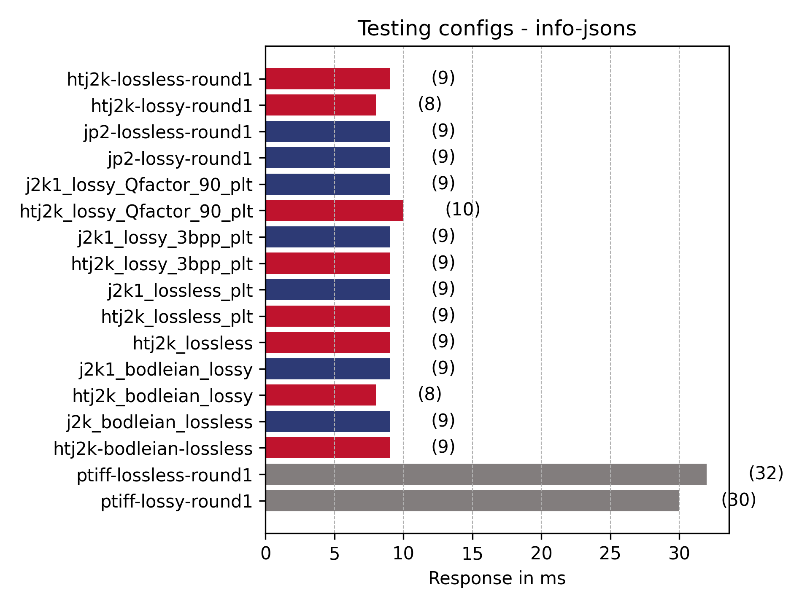

### Tile URLs (iiif_urls_unique)

_tile images are the most commonly requested image from IIIF viewers. As a user zooms into an image the IIIF viewer will request more detailed tiles_

Summary of results:
 
 * pTiff clearly quicker for this interaction. 
 * Clearly PLT makes a big difference. (htj2k_lossless is without plt)
 * Interestingly j2k1 QFactor 90 and the Bodleian jp2 lossy are similar. 
 * Lossy QFactor is quickest for both ht and jp2 part 1 apart from the above anomaly. 
 * htj2k now showing its faster than jp2

Comparison with previous rounds:

| File | [Run 1](../2022-08-16.md) | [Run 2](../2023-05-23/README.md) | [Run 3](../2023-05-29/README.md) | Run 4 |
| --- | --- | --- | --- | --- |
| Htj2k-lossless | 35 |  36 | 38 | 39 |
| Htj2k-lossy |  29 | 28 | 29 | 30 | 
| jp2-lossless | 68 | 65 | 61 | 69 |
| jp2-lossy | 66 | 61 | 65 | 67 | 
| ptiff-lossless | 12 | 12 | 13 | 14 |
| ptiff-lossy | 12 | 11 | 12 | 12 |

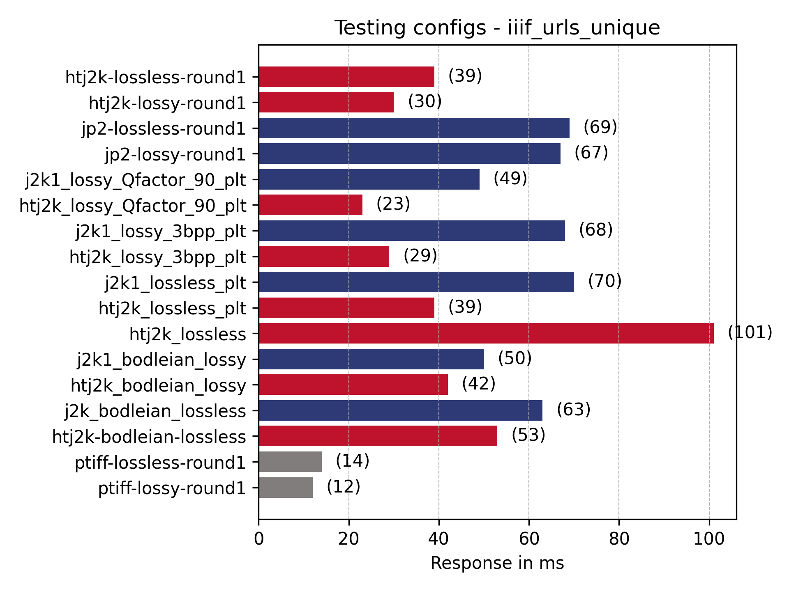

### Full region at different sizes

_The smaller sized full region requests are commonly requested by IIIF clients like the Universal Viewer and Mirador. Larger image requests are usually requested by users and would be less common and only if a user requested to download an image._

#### 50px full region

Summary of results:

 * Bodleian images surprisingly slow possibly due to the tiles config 
 * pTiff slightly faster compared to previous results (this could be general machine load or different version of IIPImage)
 * PLT doesn't seem to make much of a difference for full region 
 * jp2 and htj2k faster for this small range

| File | [Run 1  (ms)](../2022-08-16.md)| [Run 2 (ms)](../2023-05-23/README.md) | [Run 3](../2023-05-29/README.md) | Run 4 |
| --- | --- | --- | --- | --- |
| Htj2k-lossless | 14 |  14 |  12 | 13 |
| Htj2k-lossy |  19 | 16 | 14 | 15 |
| jp2-lossless | 21 | 18 | 16 | 18 |
| jp2-lossy | 21 | 16 | 20 | 22 |
| ptiff-lossless | 14 | 40 | 34 | 36 |
| ptiff-lossy | 16 | 44 |  32 | 34 |

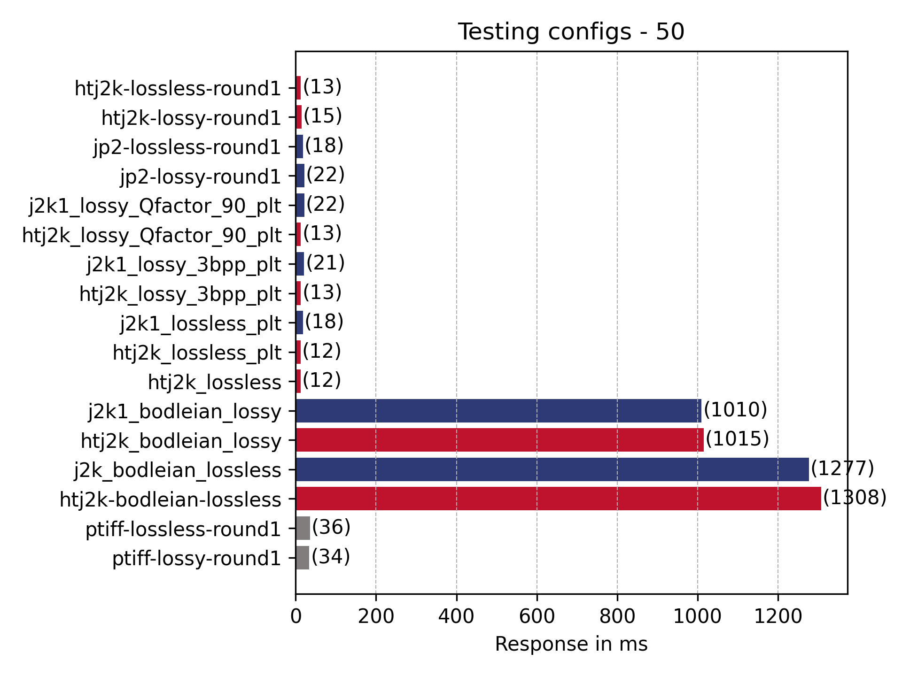

#### 500px wide image

Summary of results:

 * PLT slight disadvantage? 
 * Bodleian images surprisingly slow
 * htj2k faster in all cases than jp2
 * pTiff and htj2k similar speeds

| File | [Run 1  (ms)](../2022-08-16.md)| [Run 2 (ms)](../2023-05-23/README.md) | [Run 3](../2023-05-29/README.md) | Run 4 |
| --- | --- | --- | --- | --- |
| htj2k-lossless  | 47 | 62 | 98 | 57 |
| htj2k-lossy   | 49 | 77 | 98 | 67 |
| jp2-lossless   | 130 | 154 | 159 | 149 | 
| jp2-lossy  | 156 | 185 | 205 | 179 |
| ptiff-lossless  | 65 | 82 | 109 | 72 |
| ptiff-lossy  | 61 | 63 | 87 | 54 |

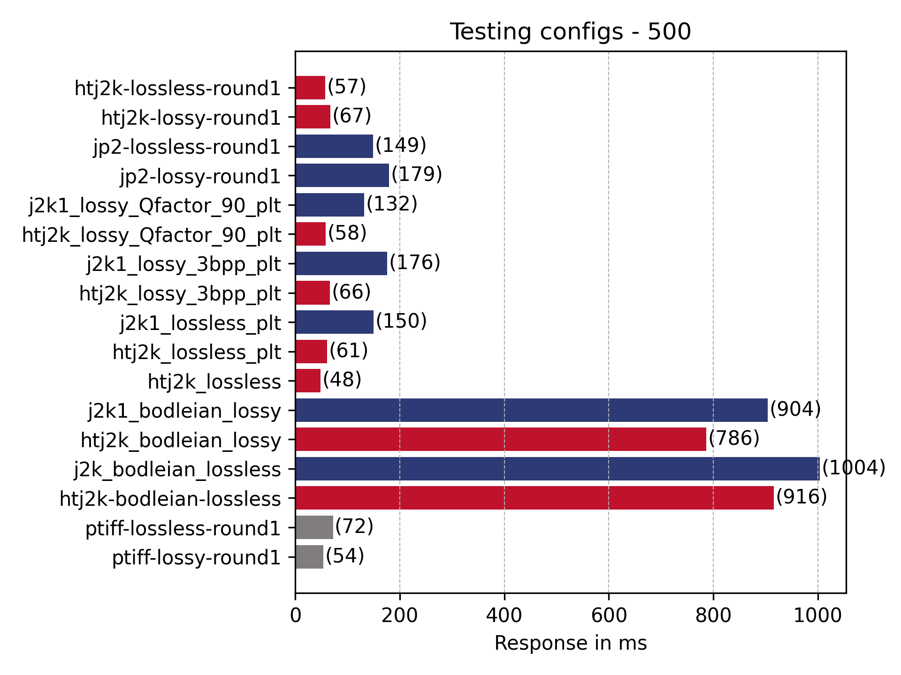

#### 1024px wide image

Summary of results:

 * PLT slight disadvantage? 
 * Bodleian images surprisingly slow
 * htj2k faster in all cases than jp2
 * pTiff and htj2k similar speeds

| File | [Run 1  (ms)](../2022-08-16.md)| [Run 2 (ms)](../2023-05-23/README.md) | [Run 3](../2023-05-29/README.md) | Run 4 |
| --- | --- | --- | --- | --- | 
| htj2k-lossless  | 151 | 208 | 249 | 204 |
| htj2k-lossy   | 147 | 210 | 251 | 203 |
| jp2-lossless   | 494 | 566 | 586 | 567 |
| jp2-lossy  | 504 | 556 | 609 | 558 |
| ptiff-lossless  | 187 | 188 | 213 | 178 |
| ptiff-lossy  | 167 | 139 | 156 | 131 |

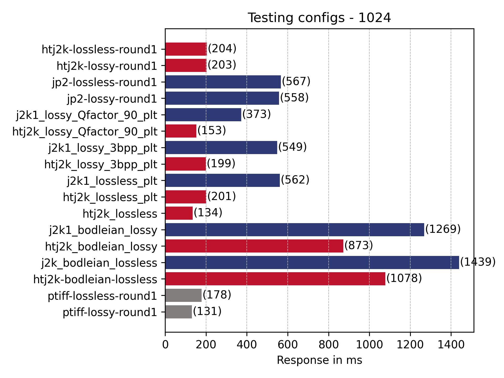

#### 3000px wide image

Summary of results:

 * PLT slight disadvantage? 
 * QFactor starting to be important 
 * Bodleian images starting to be more comparable 
 * htj2k faster in all cases than jp2
 * pTiff and htj2k similar speeds
 * QFactor making a difference 

| File | [Run 1  (ms)](../2022-08-16.md)| [Run 2 (ms)](../2023-05-23/README.md) | [Run 3](../2023-05-29/README.md) | Run 4 |
| --- | --- | --- | --- | --- |
| htj2k-lossless  | 1210 | 1416 | 1262 | 1560 |
| htj2k-lossy   |  1055 | 1077 | 961 | 1191 |
| jp2-lossless   | 3517 | 3422 | 3435 | 3778 |
| jp2-lossy  |  2493 | 2346 | 2378 | 2621 |
| ptiff-lossless  | 1179 | 1105 | 1083 | 1209 |
| ptiff-lossy  | 1007 | 818 | 798 | 913 |

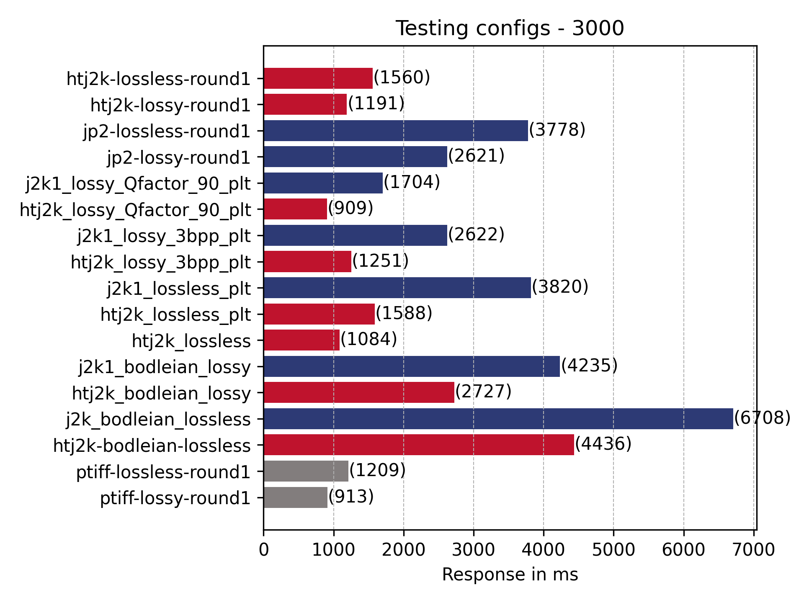

### Full region full size

Summary of results:

 * PLT slight disadvantage? 
 * QFactor faster but all lossy images quicker 
 * Bodleian images starting to be more comparable but still slower
 * htj2k faster in all cases than jp2

| File | [Run 1  (ms)](../2022-08-16.md)| [Run 2 (ms)](../2023-05-23/README.md) | [Run 3](../2023-05-29/README.md) | Run 4 |
| --- | --- | --- | --- | --- |
| htj2k-lossless  | n/a | 7874 | n/a | 5924 |
| htj2k-lossy   |  n/a | 7645 | n/a | 5685 |
| jp2-lossless   |  n/a | 18405 | n/a | 16539 |
| jp2-lossy  |   n/a | 6813 | n/a | 5955 |
| ptiff-lossless  |  n/a | 5877 | n/a | 4776 |
| ptiff-lossy  |  n/a | 6947 | n/a | 5131 |

Note first and 3rd run didn't create any Full results due to a bug in IIPimage.

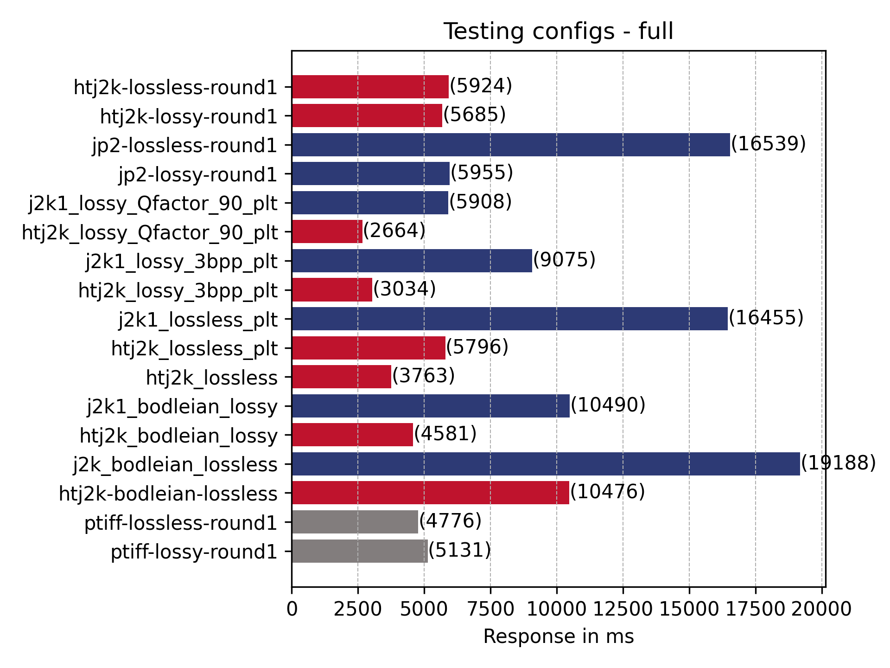

There were also a number of errors:

| Type | Name | Request Count | Failure Count | Median Response Time | Average Response Time | Min Response Time | Max Response Time | Average Content Size | Requests/s | Failures/s | 50% | 66% | 75% | 80% | 90% | 95% | 98% | 99% | 99.9% | 99.99% | 100% |
| --- | --- | --- | --- | --- | --- | --- | --- | --- | --- | --- | --- | --- | --- | --- | --- | --- | --- | --- | --- | --- | --- |
| GET | htj2k-bodelian-lossless | 50 | 0 | 7000 | 10476 | 3719 | 84175 | 28772226 | 0 | 0 | 7200 | 9100 | 9500 | 11000 | 14000 | 18000 | 84000 | 84000 | 84000 | 84000 | 84000 |
| GET | htj2k-lossless-round1 | 50 | 0 | 3900 | 5924 | 1783 | 42351 | 28772226 | 0 | 0 | 4200 | 5100 | 5900 | 6200 | 9400 | 11000 | 42000 | 42000 | 42000 | 42000 | 42000 |
| GET | htj2k-lossy-round1 | 50 | 0 | 1900 | 5685 | 1069 | 93310 | 28210423 | 0 | 0 | 2000 | 2400 | 2900 | 2900 | 3900 | 4500 | 93000 | 93000 | 93000 | 93000 | 93000 |
| GET | htj2k_bodelian_lossy | 50 | 0 | 3200 | 4581 | 984 | 29794 | 28166913 | 0 | 0 | 3200 | 4100 | 4200 | 4900 | 7500 | 8600 | 30000 | 30000 | 30000 | 30000 | 30000 |
| GET | htj2k_lossless | 50 | 0 | 2900 | 3763 | 1490 | 24642 | 28772226 | 0 | 0 | 2900 | 3300 | 3600 | 3900 | 5000 | 6800 | 25000 | 25000 | 25000 | 25000 | 25000 |
| GET | htj2k_lossless_plt | 50 | 0 | 4100 | 5796 | 1803 | 40022 | 28772226 | 0 | 0 | 4200 | 5000 | 5700 | 6100 | 8700 | 12000 | 40000 | 40000 | 40000 | 40000 | 40000 |
| GET | htj2k_lossy_3bpp_plt | 50 | 0 | 1900 | 3034 | 1252 | 30727 | 28214075 | 0 | 0 | 1900 | 2500 | 2700 | 2900 | 3500 | 4600 | 31000 | 31000 | 31000 | 31000 | 31000 |
| GET | htj2k_lossy_Qfactor_90_plt | 50 | 0 | 1600 | 2664 | 809 | 30373 | 27595401 | 0 | 0 | 1600 | 1800 | 2000 | 2300 | 2900 | 5300 | 30000 | 30000 | 30000 | 30000 | 30000 |
| GET | j2k1_bodelian_lossy | 50 | 1 | 5500 | 10490 | 1706 | 120008 | 24549643 | 0 | 0 | 5600 | 6800 | 6900 | 7900 | 12000 | 14000 | 120000 | 120000 | 120000 | 120000 | 120000 |
| GET | j2k1_lossless_plt | 50 | 2 | 11000 | 16455 | 4859 | 120021 | 21315737 | 0 | 0 | 11000 | 13000 | 15000 | 16000 | 23000 | 32000 | 120000 | 120000 | 120000 | 120000 | 120000 |
| GET | j2k1_lossy_3bpp_plt | 50 | 1 | 4300 | 9075 | 1551 | 120011 | 24572317 | 0 | 0 | 4600 | 5100 | 5300 | 6100 | 9200 | 11000 | 120000 | 120000 | 120000 | 120000 | 120000 |
| GET | j2k1_lossy_Qfactor_90_plt | 49 | 1 | 2700 | 5908 | 931 | 120016 | 23729376 | 0 | 0 | 2700 | 3200 | 3400 | 3700 | 6600 | 12000 | 120000 | 120000 | 120000 | 120000 | 120000 |
| GET | j2k_bodelian_lossless | 50 | 2 | 13000 | 19188 | 6161 | 120014 | 21315737 | 0 | 0 | 14000 | 16000 | 18000 | 20000 | 29000 | 39000 | 120000 | 120000 | 120000 | 120000 | 120000 |
| GET | jp2-lossless-round1 | 50 | 2 | 11000 | 16539 | 4839 | 120144 | 21315737 | 0 | 0 | 11000 | 13000 | 15000 | 16000 | 24000 | 32000 | 120000 | 120000 | 120000 | 120000 | 120000 |
| GET | jp2-lossy-round1 | 50 | 0 | 4200 | 5955 | 1774 | 39412 | 28295840 | 0 | 0 | 4400 | 5000 | 5300 | 5800 | 9000 | 10000 | 39000 | 39000 | 39000 | 39000 | 39000 |
| GET | ptiff-lossless-round1 | 50 | 0 | 3300 | 4776 | 1343 | 34826 | 28772218 | 0 | 0 | 3400 | 4000 | 4500 | 4800 | 7300 | 8400 | 35000 | 35000 | 35000 | 35000 | 35000 |
| GET | ptiff-lossy-round1 | 50 | 0 | 2400 | 5131 | 870 | 77610 | 28930292 | 0 | 0 | 2400 | 2900 | 3100 | 3900 | 5300 | 28000 | 78000 | 78000 | 78000 | 78000 | 78000 |
|  | Aggregated | 849 | 9 | 4000 | 7970 | 809 | 120144 | 26478094 | 0 | 0 | 4000 | 5700 | 7600 | 9100 | 14000 | 23000 | 42000 | 120000 | 120000 | 120000 | 120000 |

Due to timeouts:

| Method | Name | Error | Occurrences |
| --- | --- | --- | --- |
| GET | j2k1_lossy_Qfactor_90_plt | HTTPError('504 Server Error: Gateway Time-out for url: j2k1_lossy_Qfactor_90_plt') | 1 |
| GET | j2k1_lossless_plt | HTTPError('504 Server Error: Gateway Time-out for url: j2k1_lossless_plt') | 2 |
| GET | j2k_bodelian_lossless | HTTPError('504 Server Error: Gateway Time-out for url: j2k_bodelian_lossless') | 2 |
| GET | jp2-lossless-round1 | HTTPError('504 Server Error: Gateway Time-out for url: jp2-lossless-round1') | 2 |
| GET | j2k1_lossy_3bpp_plt | HTTPError('504 Server Error: Gateway Time-out for url: j2k1_lossy_3bpp_plt') | 1 |
| GET | j2k1_bodelian_lossy | HTTPError('504 Server Error: Gateway Time-out for url: j2k1_bodelian_lossy') | 1 |

### Universal Viewer

_This is one of the popular IIIF viewers. The URLs have been generated by creating a manifest with all 50 images in and then navigating between all of the images and zooming around the first few images._

Summary of results:

 * PLT big advantage 
 * QFactor important 
 * Bodleian lossless a lot slower, lossy comparable with others
 * htj2k faster in all cases than jp2
 * pTiff and htj2k similar speeds apart from the one that doesn't have htj2k
 * QFactor making a difference but generally lossy is a lot quicker

| File | [Run 1  (ms)](../2022-08-16.md)| [Run 2 (ms)](../2023-05-23/README.md) | [Run 3](../2023-05-29/README.md) | Run 4 |
| --- | --- | --- | --- | --- |
| htj2k-lossless  | n/a | 20 | n/a | 16 |
| htj2k-lossy   |  n/a | 17 | n/a | 15 |
| jp2-lossless   | n/a | 62 | n/a | 52 |
| jp2-lossy  |  n/a | 64 | n/a | 54 |
| ptiff-lossless  | n/a | 13 | n/a | 11 |
| ptiff-lossy  | n/a | 12 | n/a | 10 |

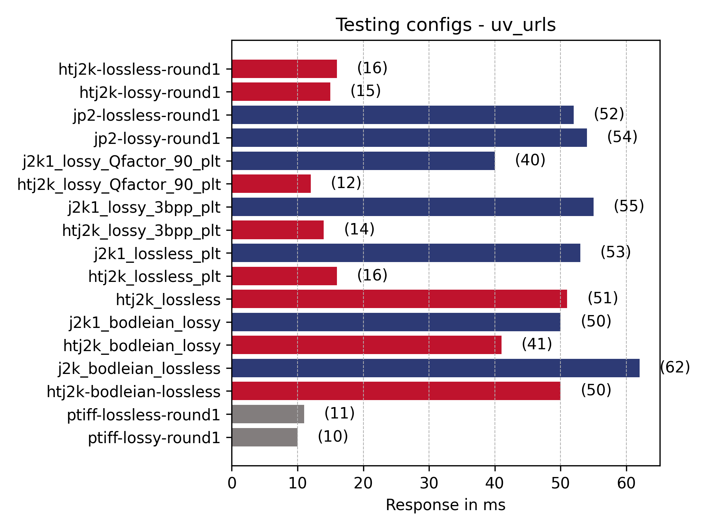

### Mirador

_This is another popular IIIF viewers. The URLs have been generated by creating a manifest with all 50 images in and then navigating between all of the images and zooming around the first few images._

Summary of results:

 * PLT big advantage 
 * QFactor important 
 * Bodleian lossless a lot slower, lossy also slower 
 * htj2k faster in all cases than jp2
 * pTiff and htj2k similar speeds apart from the one that doesn't have htj2k
 * QFactor making a difference but generally lossy is a lot quicker

| File | [Run 1  (ms)](../2022-08-16.md)| [Run 2 (ms)](../2023-05-23/README.md) | [Run 3](../2023-05-29/README.md) | Run 4 |
| --- | --- | --- | --- | --- |
| htj2k-lossless  | n/a | 16 | n/a | 16 |
| htj2k-lossy   |  n/a | 15 | n/a | 15 |
| jp2-lossless   | n/a | 56 | n/a | 53 |
| jp2-lossy  |  n/a | 58 | n/a | 55 |
| ptiff-lossless  | n/a | 11 | n/a | 11 |
| ptiff-lossy  | n/a | 10 | n/a | 10 |

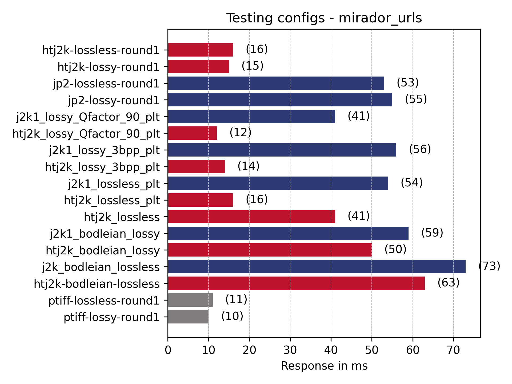 

### Random non-tile regions

_This list of URLs are for regions of an image that don't match up with a tile. This is possible with IIIF if you use a image cropying tool but isn't very common. If you use an image cropying tool you will get the URL and this URL might be requested a lot if its tweeted or put on a blog but a usual image server wouldn't get many of these requests compared to full region or tile requests_

#### Small regions (100,100 by 200,200)

Observations:
 * PLT clearly makes a big difference! 
 * jp2 + htj2k + ptiff similar for this use case
 * QFactor fastest

| File | [Run 1  (ms)](../2022-08-16.md)| [Run 2 (ms)](../2023-05-23/README.md) | [Run 3](../2023-05-29/README.md) | Run 4 |
| --- | --- | --- | --- | --- |
| htj2k-lossless  | 60 | 67 | 59 | 75 |
| htj2k-lossy  | 55 | 65 | 56 | 69 |
| jp2-lossless  | 80 | 87 | 79 | 99 |
| jp2-lossy  | 70 | 76 | 72 | 86 |
| ptiff-lossless  | 26 | 64 |  55 | 71 |
| ptiff-lossy  | 24 |  60 | 49 | 65 |

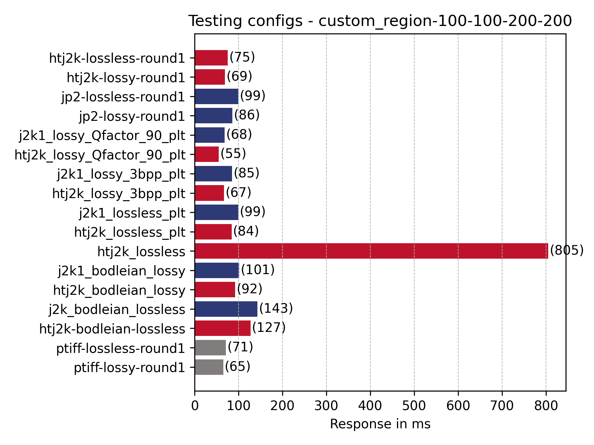

### Large regions (100,100 by 2000,2000)

Observations:
 * Lossy qfactor as fast as ptiff
 * QFactor fastest

| File | [Run 1  (ms)](../2022-08-16.md)| [Run 2 (ms)](../2023-05-23/README.md) | [Run 3](../2023-05-29/README.md) | Run 4 |
| --- | --- | --- | --- | --- |
|      htj2k-lossless  |    380 | 490 | 364 | 499 |
|      htj2k-lossy |    242  | 291 | 204 | 292 |
|      jp2-lossless |    735 | 815 | 677 | 853 |
|      jp2-lossy |    347 | 385 | 307 | 408 |
|      ptiff-lossless |    265  | 303 | 232 | 302 |
|      ptiff-lossy |    248   | 230 | 186 | 245 |

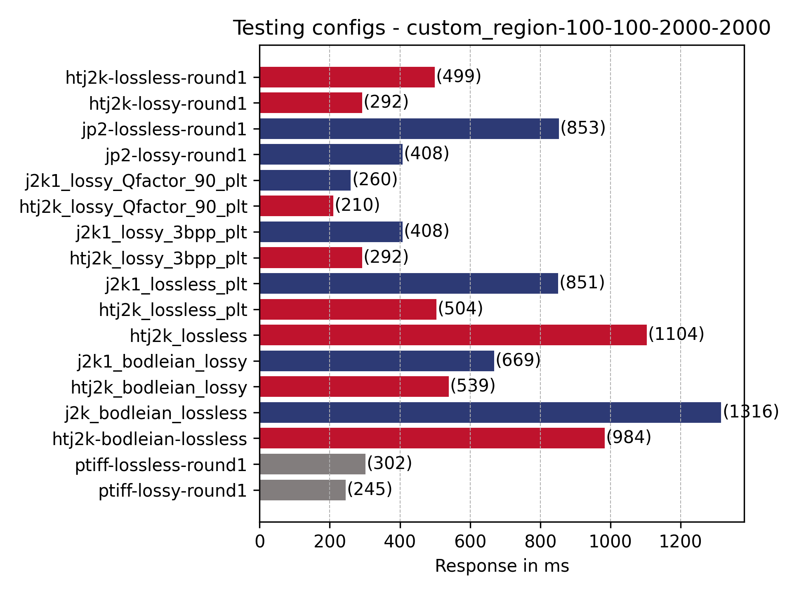

## Summary

 * QFactor a good recommendation
 * htj2k faster than jp2
 * Bodleian images very slow on full region
 * PLT slower for full region images?

[htj2k_lossless_plt](../2023-05-29/scripts/encode_htj2k_lossless_plt_codeblock_64%2C64.sh)
 * Cmodes=HT 
 * Creversible=yes 
 * ***ORGgen_plt=yes*** 
 * Cblk="{64,64}" 
 * Clevels=8 

[htj2k_lossless](../2023-05-29/scripts/encode_htj2k_lossless_codeblock_64%2C64.sh) 
 * Cmodes=HT 
 * Creversible=yes 
 * Cblk="{64,64}" 
 * Clevels=8 