# Decoding results
The fastest threading configuration is noted with text t=1, t=2, t=4, t=8, or t=16 next to each decoding result

## decode the whole image at different scales
### notes
- HTJ2K is much faster than J2K1 (JPEG2000 Part-1 aka "jp2") for large decoded regions
- PLT doesn't have impact when all encodings already have a resolution progressive progression order
- tiling (used by digital bodelian) slows down decoding of image at small scale (50, 500)  

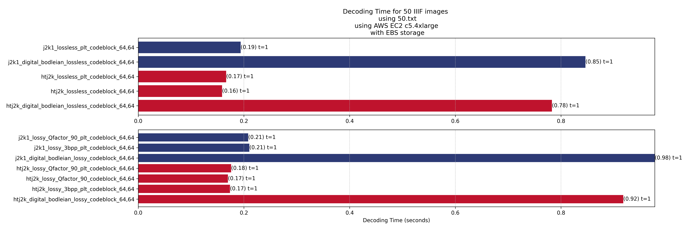
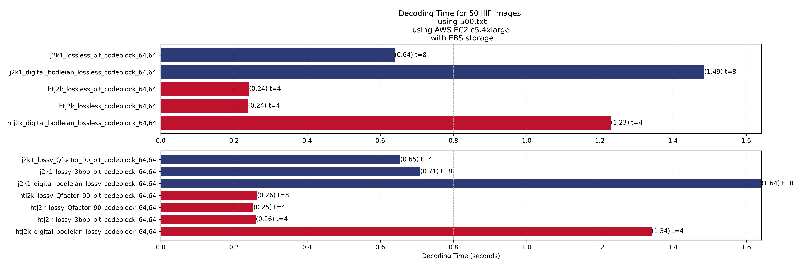
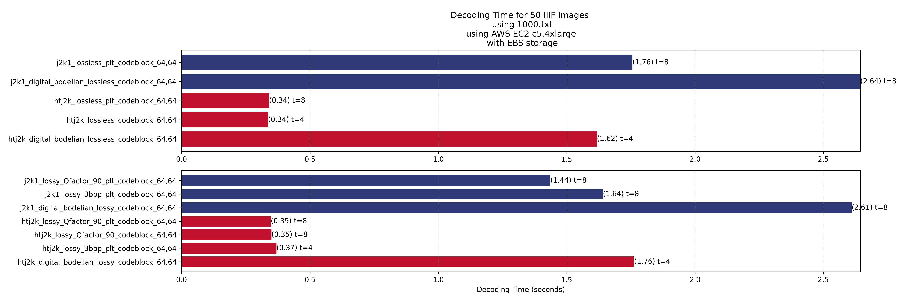
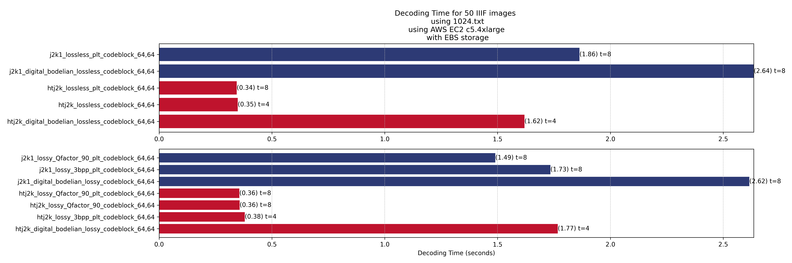
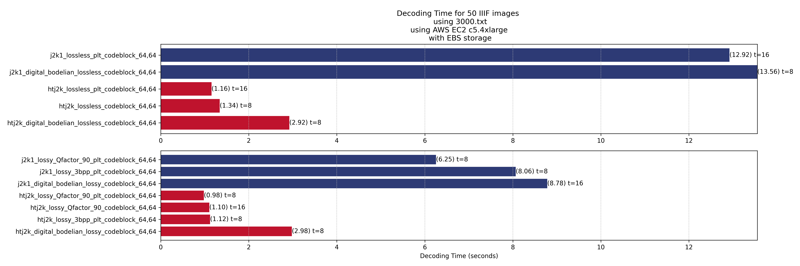
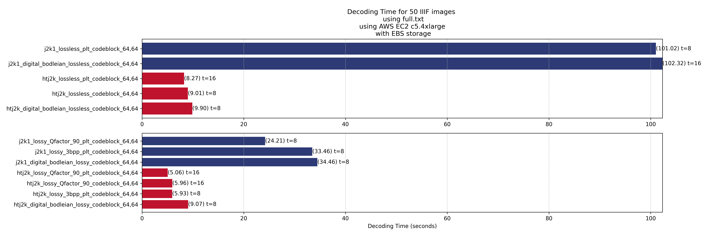

## decoding specific small area
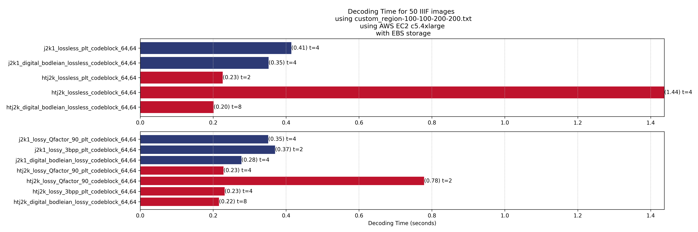

### notes
- HTJ2K is about 50% faster than J2K1
- PLT helps speed up spatial random access decoding

## decoding specific large area
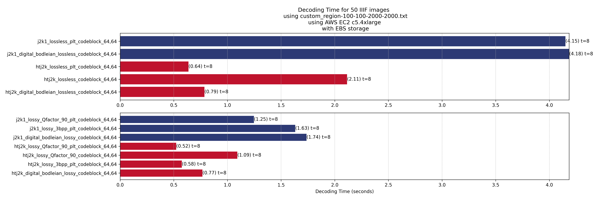
### notes
- HTJ2K is about 6x faster than J2K1
- PLT helps speed up spatial random access decoding

## a mix of decoding small areas and decoding the whole image at different scales
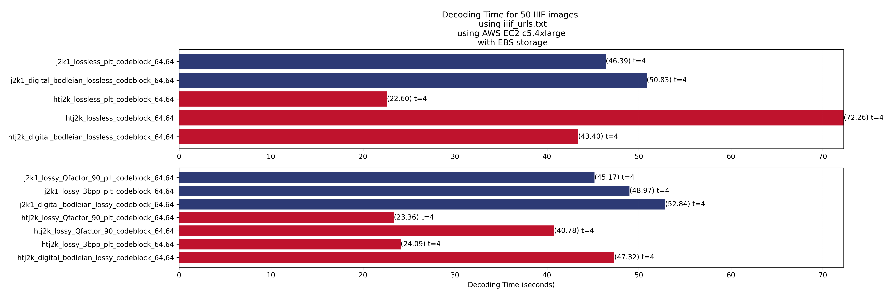
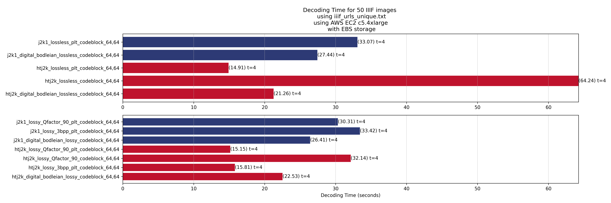

### notes
- HTJ2K is about 2x faster than J2K1
- PLT helps speed up spatial random access decoding

## requests generated during an actual browsing session by a normal real human being
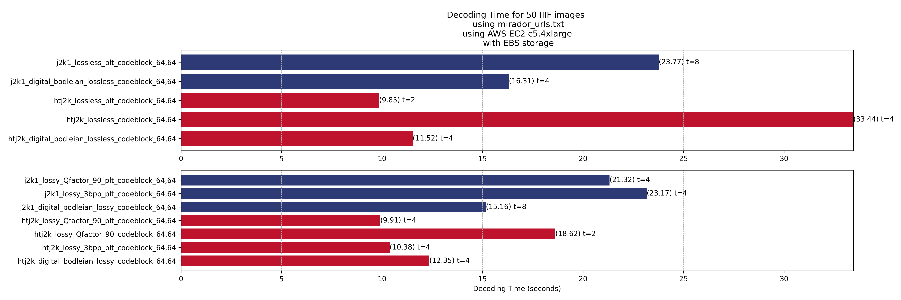

### notes
- HTJ2K is about 2x faster than J2K1
- PLT helps speed up spatial random access decoding

# Encoding results
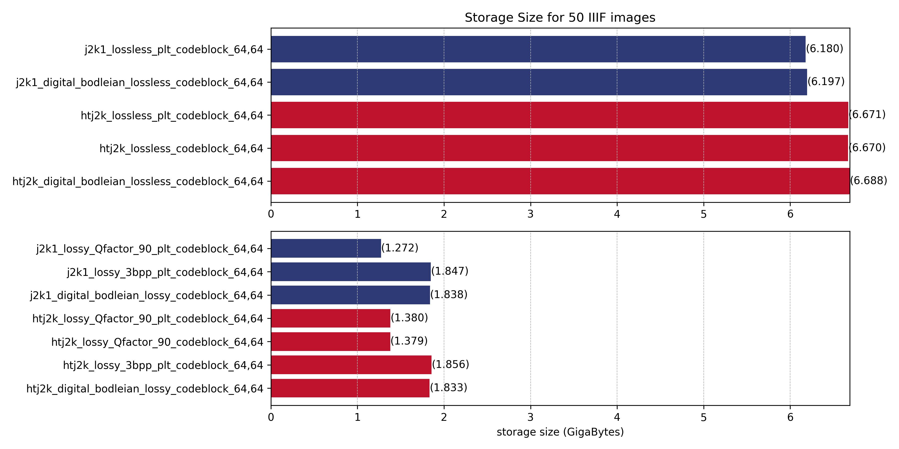

