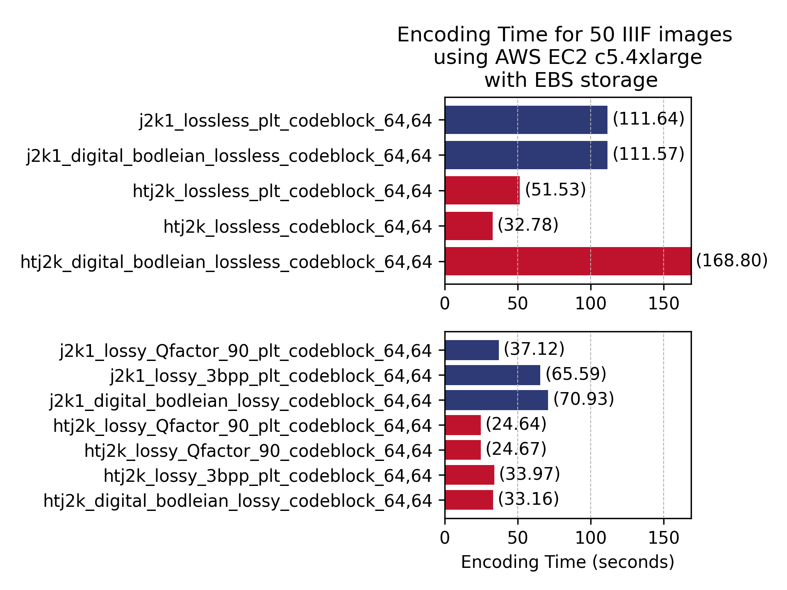
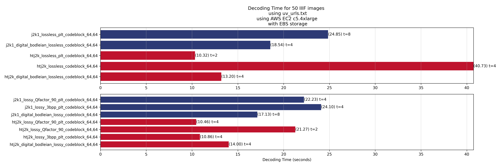

# Encoding results

# Decoding results

## decode the whole image at different scales 

## decoding specific randomly generated small areas at different scales

## a mix of decoding small areas and decoding the whole image at different scales

## requests generated during an actual browsing session by a normal real human being

